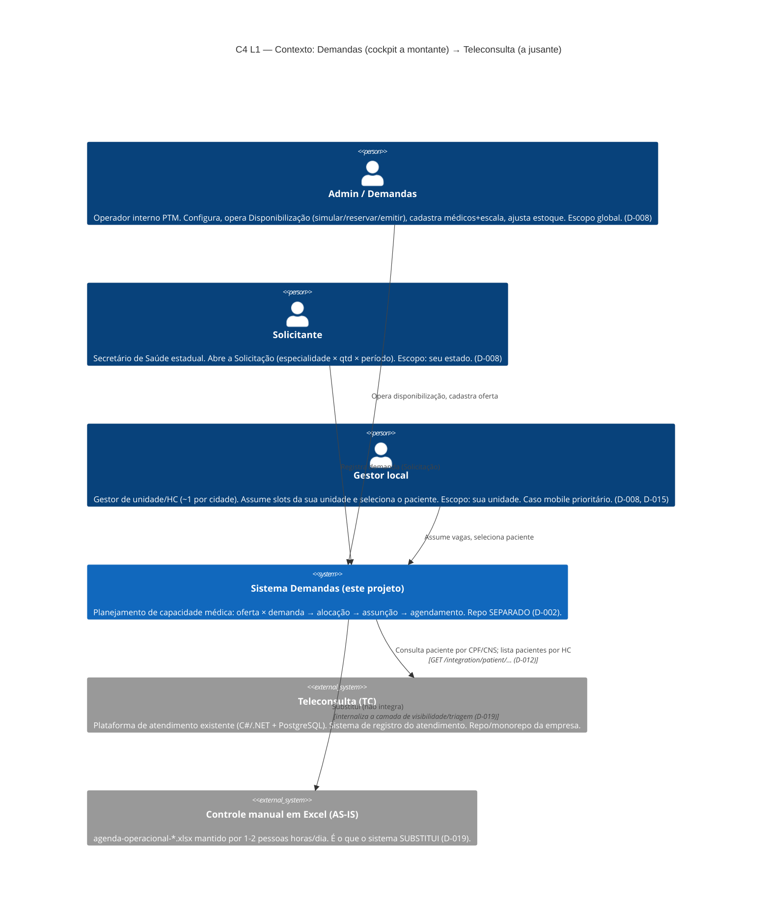
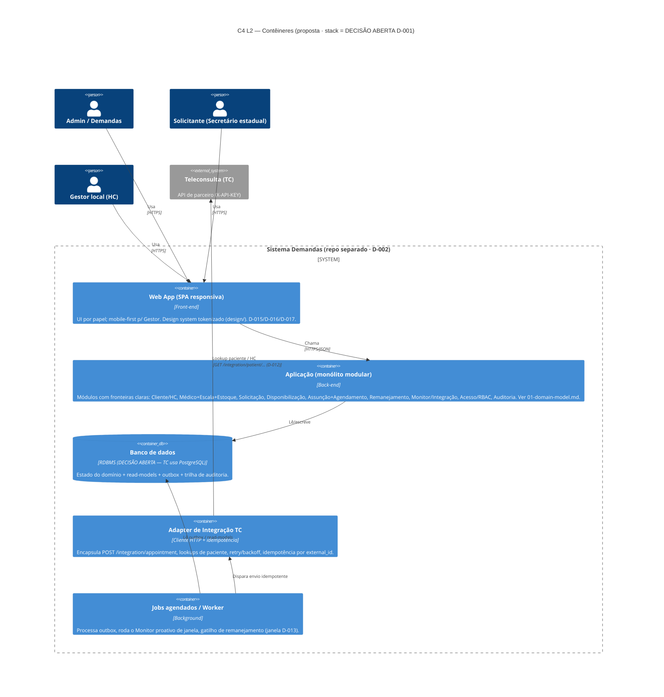
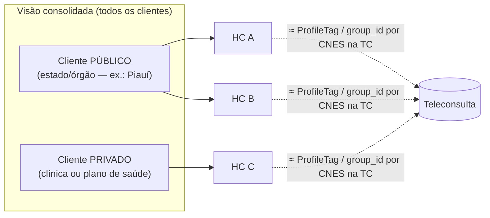
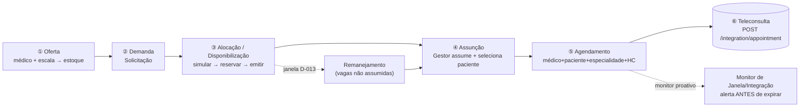

# 00 — Visão Geral / Contexto C4 (L1 e L2)

> Documento de arquitetura. **Não cria regra de negócio** — toda regra citada está rastreada a um
> `D-xxx` (`docs/decisions/decisions-log.md`) ou a um doc de descoberta. O que falta está marcado
> 🔴 (bloqueia) / 🟡 (importante). **Stack permanece DECISÃO ABERTA (D-001)** — ver `02-system-design.md`.

## 0. Em uma frase

O sistema **"Demandas"** (nome provisório "Agenda Fixa") é o **cockpit a montante** que **tira o
controle do Excel** (`agenda-operacional-*.xlsx`, D-019) e **alimenta a Teleconsulta (TC) a jusante**
com agendamentos prontos, integrando como **parceiro externo** via `POST /integration/appointment`
+ header `X-API-KEY` (D-002, contrato em `04-integration-teleconsulta.md`). Não substitui a TC.

## 1. C4 Nível 1 — Contexto do Sistema

### Fronteira de integração (D-002 / D-003)

- O sistema é um **produto/repo SEPARADO** e integra com a TC **como parceiro**, não como serviço
  dentro do monorepo da TC (**D-002**). Existe um diretório `services/saude-digital-demandas/`
  **vazio** no monorepo da TC — sinal de que já se cogitou viver dentro; a decisão tomada foi repo
  separado (D-002).
- A **alocação de médico é NOSSA** (**D-003**): nós decidimos o médico e o enviamos em
  `preference_of_doctor_id`; a TC **respeita** o `external_appointments`. Sem sobreposição com o
  `ptm-matching-api` da TC.
- A integração é **síncrona, por API-key de parceiro**, sem FHIR/RNDS na v1
  (`04-integration-teleconsulta.md` §5). Idempotência via `external_id` (UNIQUE na TC).

## 2. C4 Nível 2 — Contêineres (proposta)

> Os contêineres abaixo são **proposta de arquitetura** (rastreada a `02-system-design.md`). A
> escolha de runtime/stack é **DECISÃO ABERTA (D-001)**. A forma recomendada é **monólito modular**
> + um **adapter de integração** isolado.

## 3. Atores e papéis (D-008, D-010)

| Ator | Quem é | Faz login? | Escopo | Fonte |
|---|---|---|---|---|
| **Admin / Demandas** | Operador interno PTM | ✅ Sim | Global | D-008 |
| **Solicitante** | Secretário de Saúde estadual | ✅ Sim | Seu estado (🟡 isolamento a confirmar) | D-008 |
| **Gestor** | Gestor local de unidade/HC (~1/cidade) | ✅ Sim | Sua unidade (🟡 isolamento a confirmar) | D-008 |
| **Doutor** | Médico cadastrado com escala | ❌ Não (é DADO) | — | D-010 |
| **Paciente** | Selecionado pelo Gestor; master é da TC | ❌ Não (é DADO) | — | D-010, D-012 |

> 🟡 Escopo de dados (Solicitante vê só o estado; Gestor só a unidade) é **provável mas não confirmado**
> (`02-roles.md`, `03-open-questions.md`). O RBAC deve ser desenhado para suportá-lo (ver `02-system-design.md`).

## 4. Clientes: público e privado (D-018)

- **Cliente** é um conceito **acima de HC** (D-018). Cada cliente agrupa um ou mais **Health Centers**.
- Visões exigidas: **por HC** e **consolidado** (público + privado).
- **HC ≈ `ProfileTag` / `group_id`** na TC, identificável por **CNES**
  (`04-integration-teleconsulta.md` §3). O master do paciente é da TC (D-012), o que reduz exposição LGPD.

## 5. Pipeline de domínio (recapitulação)

Detalhe de cada bounded context e suas invariantes em **`01-domain-model.md`**.

## 6. Perguntas abertas que afetam o contexto

- 🔴 Regra da **"janela de envio"** que expira (causa dos 7,7% de perda) — não definida
  (`05-processo-manual-excel.md` §8; `monitor-integracao/ui.md` §8). Define o gatilho do Monitor.
- 🔴 O **"REGULA-HUB" (AM/SISReg)** das planilhas é a mesma fonte deste projeto (HC-SP) ou produto
  anterior? Define se o Monitor lê **da nossa integração com a TC** ou de **hub externo**
  (`05-processo-manual-excel.md` §8). No monorepo da TC há serviços `ptm-regula-hub`/`ptm-regula-sisreg`.
- 🟡 Novo **`PartnerType` + `X-API-KEY`** a ser emitido pela equipe da TC (tarefa externa).
- 🟡 Mapeamento de **especialidades** (texto / `internal_specialization_id`) entre os dois sistemas.

## Índice

Ver `README.md` desta pasta.
