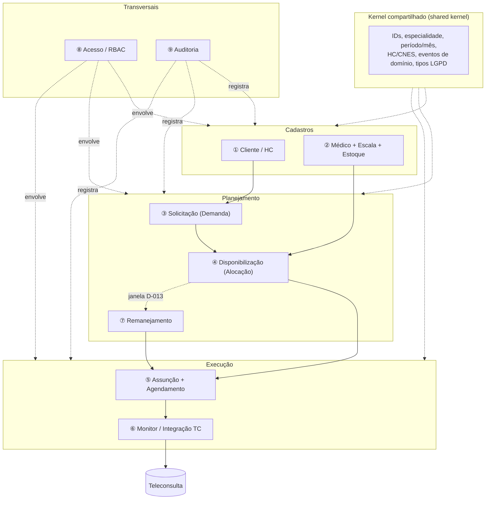

# 01 — Modelo de Domínio (bounded contexts, agregados, invariantes)

> **Zero inferência de regra** (Diretriz Suprema `CLAUDE.md`). Cada invariante abaixo está rastreada
> a um `D-xxx` ou a um doc de descoberta. Onde a regra **não existe ainda**, está marcada
> 🔴 (bloqueia modelagem) / 🟡 (importante) — **não foi preenchida por "bom senso"**.

## 1. Mapa de bounded contexts

Esse particionamento é também o **mapa de módulos** do monólito modular (ver `02-system-design.md`)
e o **mapa de paralelização** dos agentes de IA (ver `03-sdd-tdd-e-agentes-paralelos.md`).

## 2. Agregados por contexto

### ① Cliente / HC (D-018)
- **Agregado raiz: `Cliente`** — tipo `PÚBLICO | PRIVADO` (D-018). Público = estado/órgão;
  Privado = clínica/plano.
- **Entidade: `HealthCenter (HC)`** — pertence a um Cliente; identificado por **CNES**;
  mapeia para `ProfileTag`/`group_id` na TC (`04-integration-teleconsulta.md` §3).
- **Invariantes:**
  - Todo HC pertence a exatamente um Cliente (D-018).
  - Visões devem permitir recorte **por HC** e **consolidado** (D-018).
- 🟡 Master do paciente é da TC (D-012) → este contexto **não** é dono de paciente.

### ② Médico + Escala + Estoque (D-005, D-010)
- **Agregado raiz: `Medico`** (DADO, não usuário — D-010): dados, especialidade, flag ativo/inativo.
- **Entidade: `Escala`** — dias de atendimento, horário, **período válido de prestação**,
  consultas/hora (`01-domain-overview.md` ①).
- **Value Object / projeção: `Estoque`** — capacidade de vagas.
- **Invariantes (D-005 — estoque MISTO):**
  - Estoque = **base calculada** (dias × horário × consultas/hora × período) **+ ajuste manual**
    ("retornos/extras"), **com auditoria** (D-005).
  - 🟡 A **fórmula exata** de derivação não está fechada (`03-open-questions.md`): confirmar
    `(horas no dia × consultas/hora) × dias válidos no período`, tratar intervalo (almoço), duração
    fixa de consulta e feriados. Parâmetros de referência do edital: **3 consultas/hora/especialista**,
    plantão mín. 4h (`05-processo-manual-excel.md` §5) — **referência, não regra confirmada**.
  - 🟡 **Granularidade do estoque**: vaga = **contagem de capacidade** OU **horário concreto**?
    (`03-open-questions.md` recomenda começar como contagem; horário concreto na assunção — **a decidir**).
  - 🟡 Ajuste manual: quem pode, trilha LGPD (`03-open-questions.md`).

### ③ Solicitação / Demanda (D-008)
- **Agregado raiz: `Solicitacao`** aberta pelo **Solicitante** (secretário estadual, D-008):
  lista de especialidades do HC × quantidade × período (mês) + identificação + data
  (`01-domain-overview.md` ②).
- **Invariantes:**
  - Criada pelo papel **Solicitante**, escopo seu estado (D-008; 🟡 isolamento a confirmar).
  - Quantidade por especialidade e período são obrigatórios (`01-domain-overview.md` ②).

### ④ Disponibilização / Alocação — **núcleo** (D-003, D-005)
- **Agregado raiz: `Disponibilizacao`** (por Cliente/HC/período), com linhas por especialidade:
  qtd solicitada (Gov) · qtd a disponibilizar · retornos/extras (manual) · **saldo +/-**.
- **Estados/ações:** **Simular → (Limpar) → Reservar → Emitir** (`01-domain-overview.md` ③).
- **Invariantes:**
  - **Simular**: calcula saldo (demanda × estoque) **sem efetivar** (`disponibilizacao/ui.md` EARS).
  - Saldo < 0 ⇒ sinal de danger; flag **">30 dias"** para vagas com prazo de atendimento longo
    (`01-domain-overview.md` ③). 🟡 Regra exata da flag (a partir de qual data?) não fechada.
  - **Reservar**: bloqueia a escala e **baixa do estoque**; não pode reservar além do estoque
    disponível (`disponibilizacao/ui.md` EARS).
  - **Emitir**: publica as vagas para o HC **assumir** (`01-domain-overview.md` ③).
  - **D-003**: a alocação de médico é NOSSA — esta etapa prepara o vínculo que vira
    `preference_of_doctor_id`.
  - 🟡 Reversibilidade Reservar↔Emitir e se "Limpar" desfaz reserva (`disponibilizacao/ui.md` §8;
    `glossary.md` marca Reservar/Emitir 🟡).
  - 🟡 Em que ponto o médico é **amarrado** (aqui vs na Assunção) — D-003 diz "nossa", o ponto de
    decisão não está confirmado.

### ⑤ Assunção + Agendamento (D-004, D-009, D-011, D-012)
- **Agregado raiz: `Assuncao`** — o **Gestor** local **assume** os slots emitidos para sua unidade
  (D-008/D-009) e, no mesmo ato, **seleciona o paciente** (D-009).
- **Agregado: `Agendamento`** — médico + paciente + especialidade + HC (D-004). É o que vai à TC.
- **Invariantes:**
  - Paciente é associado **no momento da assunção** (D-009); a **lista de pacientes vem da TC** por
    health center, com `patient_id` já resolvido (D-012) — reduz exposição LGPD.
  - **Médico preferencial (D-011):** em **retorno**, o último doutor que atendeu vira preferencial;
    senão o Gestor escolhe um. O preferencial pode estar indisponível no dia ⇒ atendimento por
    **outro doutor da mesma especialidade** (fallback). Casa com `preference_of_doctor_id` + fallback
    de especialidade da TC (D-003/D-011).
  - O agendamento final tem schema **parcialmente ditado pela TC**
    (`04-integration-teleconsulta.md` §3): `patient_id` + `start/end` + `specialty` +
    `group_id` (HC) + `preference_of_doctor_id` (opcional) + `preference_of_service`.
  - 🟡 Como resolver `patient_id` quando o paciente **não existe** na TC (criar? por CPF/CNS?)
    (`04-integration-teleconsulta.md` §"em aberto").

### ⑥ Monitor / Integração TC (D-013, D-019)
- **Agregado/serviço: `EnvioAgendamento`** (uma tentativa de integração) com idempotência por
  `external_id` (UNIQUE na TC, `04-integration-teleconsulta.md` §"como inserir").
- **Read-model: `FunilIntegracao`** (capturados → ... → integrados; recuperáveis vs perdidos)
  espelhando o `dashboard-30d` (`05-processo-manual-excel.md` §4; `monitor-integracao/ui.md`).
- **Invariantes / objetivo:**
  - **Monitor proativo de janela**: alertar **ANTES** da janela expirar — ataca os **7,7%/mês**
    perdidos por "janela de envio expirou" (`05-processo-manual-excel.md` §4/§6; `BUILD-PROGRESS.md`).
  - 🔴 **A regra de prazo da janela não está definida** — sem ela o gatilho do alerta não pode ser
    implementado (`monitor-integracao/ui.md` §8). **Não inferir.**
  - 🔴 **Fonte do funil** (nossa integração TC vs hub externo AM/SISReg) não confirmada — define a
    leitura do Monitor (`monitor-integracao/ui.md` §8).
  - 🟡 Relação entre o **limiar de alerta** e a **janela de remanejamento** (D-013) — mesma janela? (a confirmar).

### ⑦ Remanejamento (D-006, D-013)
- **Agregado/serviço: `Remanejamento`** sobre vagas **emitidas e não assumidas**.
- **Invariantes (D-013):**
  - Gatilho por **janela configurável** (ex.: 24h/48h após disponibilização) sobre slots não assumidos.
  - Critério = **demanda não atendida** (HC com saldo negativo).
  - **Determinístico, auditável, sem ML** na v1 (D-006); **não precisa ser automático** (operador pode
    rodar), mas a **janela é configurável** (D-013).
  - Motivação: o médico já foi pago — não desperdiçar capacidade (D-013).
  - 🟡 **QUAIS regras/prioridades** de destino (ordem de HC? urgência? proximidade? data?) — não
    definidas (`01-domain-overview.md` ④). **Não inferir.**

### ⑧ Acesso / RBAC (D-008, D-010)
- **Agregados:** `Usuario`, `Papel`, `EscopoDeDados`.
- **Invariantes:**
  - **Apenas 3 papéis logam**: Admin/Demandas (global), Solicitante (estado), Gestor (unidade) (D-008).
  - **Doutor e Paciente NÃO logam** — são DADOS (D-010).
  - 🟡 Isolamento por escopo (estado/unidade) **provável**, a confirmar (`02-roles.md`).

### ⑨ Auditoria (D-005, LGPD)
- **Agregado: `RegistroAuditoria`** (append-only).
- **Invariantes:**
  - Ajuste manual de estoque é **auditável** (D-005).
  - Operações sobre dado sensível (paciente) exigem trilha (LGPD, `01-domain-overview.md` "restrições"). 🟡 base legal/retenção a definir.

## 3. Invariantes-chave (resumo rastreável)

| # | Invariante | Fonte |
|---|---|---|
| INV-1 | Alocação de médico é nossa; enviamos `preference_of_doctor_id`, TC respeita | **D-003** |
| INV-2 | Estoque = base calculada **+** ajuste manual auditável (misto) | **D-005** |
| INV-3 | Médico preferencial: retorno → último doutor; senão escolhido; fallback = mesma especialidade | **D-011** |
| INV-4 | Remanejamento por janela configurável, critério = demanda não atendida, determinístico | **D-013** / D-006 |
| INV-5 | Paciente associado no ato da assunção; lista vem da TC por HC | D-009 / **D-012** |
| INV-6 | Reservar baixa estoque e bloqueia escala; não reservar além do disponível | `01-domain-overview.md` ③ |
| INV-7 | Idempotência de envio à TC por `external_id` (UNIQUE) | `04-integration-teleconsulta.md` |
| INV-8 | Só 3 papéis logam; Doutor/Paciente são dados | **D-008 / D-010** |

## 4. Perguntas abertas que bloqueiam/afetam a modelagem

- 🔴 Regra de prazo da **janela de envio** (gatilho do Monitor) — `monitor-integracao/ui.md` §8.
- 🔴 **Fonte do funil de integração** (TC própria vs hub externo) — `monitor-integracao/ui.md` §8.
- 🟡 **Granularidade do estoque** (contagem vs horário) — `03-open-questions.md`.
- 🟡 **Fórmula exata de capacidade** (intervalo/feriado/duração) — `03-open-questions.md`.
- 🟡 **Regras de prioridade do remanejamento** — `01-domain-overview.md` ④.
- 🟡 **Resolução de `patient_id`** quando paciente não existe na TC — `04-integration-teleconsulta.md`.
- 🟡 **Isolamento de escopo** por estado/unidade — `02-roles.md`.
- 🟡 Em que etapa o **médico é amarrado** (Disponibilização vs Assunção) — `disponibilizacao/ui.md` §8.
