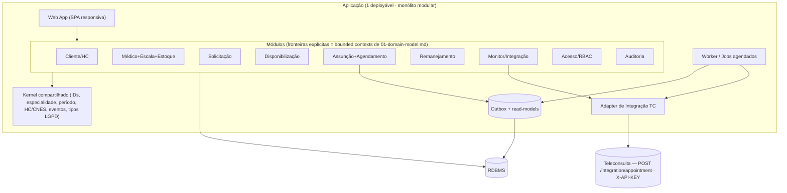
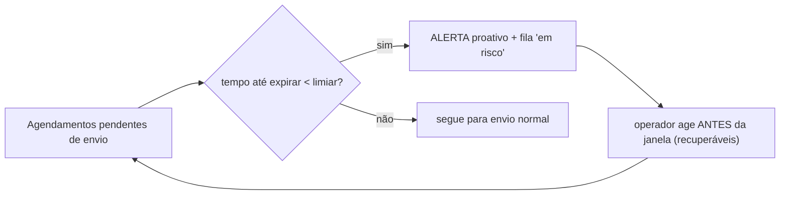

# 02 — System Design (arquitetura proposta)

> ⚠️ **STACK = DECISÃO ABERTA (D-001):** a Fase 1 proíbe finalizar linguagem/framework/banco.
> Este doc **apresenta opções e trade-offs** e **não escolhe**. Tudo que for invariante de negócio
> está rastreado a um `D-xxx`; o que falta está marcado 🔴/🟡 (não inferido).

## 1. Estilo arquitetural recomendado: **monólito modular**

Para **1 dev + IA** num sistema de saúde, a recomendação é **monólito modular** (um deployável, com
**fronteiras de módulo explícitas**) — **não** microserviços. Razões:

- **1 dev**: microserviços multiplicam infra/CI/observabilidade sem retorno nesta escala.
- **Lotes pequenos e núcleo crítico à mão** (`CLAUDE.md` princípios de risco 3 e 4): fronteiras de
  módulo testadas dão isolamento suficiente sem custo de rede distribuída.
- **Repo separado (D-002)** já duplica infra/CI vs a TC; não adicionar mais fragmentação interna.
- Caminho de evolução: um módulo pode ser **extraído** para serviço depois, **se** as fronteiras
  forem respeitadas (contratos in-process hoje → contratos de rede amanhã).



> Regra de fronteira: **um módulo só fala com outro por um contrato** (interface/porta) — nunca
> tocando tabelas alheias. Isso é o que permite agentes de IA em paralelo (ver `03-...`).

## 2. Adapter de Integração com a Teleconsulta (peça crítica)

Encapsula **toda** a conversa com a TC atrás de uma porta (`ITeleconsultaPort`), de modo que o resto
do sistema não conheça HTTP/headers/DTOs da TC. Baseado no contrato **descoberto** em
`04-integration-teleconsulta.md` (factual — reconfirmar contra
`specs/PRD-002-substituicao-absens/technical/api-contracts.md` da TC na hora de construir).

### 2.1 Responsabilidades

1. **Envio de agendamento:** `POST /integration/appointment` com header **`X-API-KEY`** (novo
   **`PartnerType`** a ser emitido pela equipe da TC — D-002; o enum atual tem `Unknown, SOSPlantao,
   InfoBip, SOSPortal, MedSafe, RegulaHub, Seduc, AuthServer`).
2. **Idempotência por `external_id`** (UNIQUE na TC): retry seguro. Sugestão de chave estável
   `regulation_code-confirmation_key` (`04-integration-teleconsulta.md`).
3. **Lookups de apoio:** paciente por CPF/CNS (`GET /integration/patient/idbycpf`), HC/`group_id`
   por CNES (`GET /integration/profile-tags/by-cnes`), checagem de existência por `external_id`,
   lista de agendamentos ativos (dedup) e **lista de pacientes por HC** (D-012).
4. **Tratamento de `preference_of_doctor_id`:** se a TC retornar **409**, **repetir sem ele**
   (fallback de especialidade — alinhado a D-011/D-003) (`04-integration-teleconsulta.md`).
5. **Retry/backoff** exponencial com jitter + **circuit breaker**; idempotência garante segurança.
6. **Monitor proativo da "janela de envio"** (ver §3) — mata os **7,7%** (D-019).

### 2.2 Campos do payload (factual — `CreateExternalAppointmentViewModel`)

| Campo (TC) | Obrig. | Origem no nosso domínio | Nota |
|---|---|---|---|
| `patient_id` (GUID) | ✅ | resolvido via TC (D-012) | lookup CPF/CNS |
| `external_id` | ✅ | nossa chave de idempotência | UNIQUE na TC |
| `start_date`/`end_date` (DateTimeOffset) | ✅ | janela do slot | ISO 8601 c/ offset |
| `preference_of_service` | ✅ | "ONLINE"/"PRESENCIAL" | 🟡 default a confirmar |
| `specialty` / `internal_specialization_id` | (recom.) | especialidade da Solicitação | 🟡 mapeamento a fechar |
| `group_id` (HC) | (recom.) | HC por CNES | sempre enviar |
| `preference_of_doctor_id` | opcional | médico preferencial (D-011) | se 409, repetir sem |
| `regulation_code`, `confirmation_key`, `source`, `status` | opcional | auditoria; status default `Pending` | |

### 2.3 Fluxo de envio idempotente (outbox + worker)

```mermaid
sequenceDiagram
    participant M5 as Assunção/Agendamento
    participant OB as Outbox (DB)
    participant W as Worker
    participant AD as Adapter TC
    participant TC as Teleconsulta

    M5->>OB: grava AgendamentoPronto (mesma tx do domínio)
    W->>OB: poll pendentes
    W->>AD: enviar(external_id, payload)
    AD->>TC: POST /integration/appointment (X-API-KEY)
    alt 200/201 OK
        TC-->>AD: ok (external_id)
        AD->>OB: marca enviado (idempotente)
    else 409 conflito de médico
        AD->>TC: repetir SEM preference_of_doctor_id (D-011)
        TC-->>AD: ok
        AD->>OB: marca enviado (fallback especialidade)
    else 5xx / timeout
        AD->>OB: agenda retry (backoff+jitter); registra tentativa
    end
```

## 3. Monitor proativo da "janela de envio" (o diferencial — D-019)

O Excel hoje é **reativo**: a perda de **7,7%/mês** por "janela de envio expirou" só é vista
**depois** (`05-processo-manual-excel.md` §4/§6). O sistema converte isso em **alerta antes**.



- 🔴 **Bloqueio:** a **regra de prazo da janela** não está definida (`monitor-integracao/ui.md` §8;
  `03-open-questions.md`). O Monitor e o limiar de alerta ficam **parametrizados/configuráveis** até
  a regra ser confirmada — **não inferir o prazo**.
- 🔴 **Fonte do funil** (nossa integração TC vs hub externo AM/SISReg) também a confirmar — define se
  o Monitor lê da nossa outbox/integração ou consome um hub externo.

## 4. Padrões de escalabilidade e resiliência

| Padrão | Para quê | Rastreabilidade |
|---|---|---|
| **Idempotência** (`external_id`) | retry de envio seguro | `04-integration-teleconsulta.md` (UNIQUE) |
| **Outbox + eventos de domínio** | desacoplar gravação do domínio do envio à TC; nada se perde em falha de rede | mitiga perda por janela (D-019) |
| **Read-models / projeções** | dashboards (saldo, funil, KPIs) sem onerar o transacional | `disponibilizacao/ui.md`, `monitor-integracao/ui.md` |
| **Jobs agendados / worker** | gatilho de remanejamento (janela D-013), varredura de janela, processamento de outbox | D-013 |
| **Retry com backoff+jitter + circuit breaker** | resiliência à indisponibilidade da TC | resiliência |
| **Observabilidade** (logs estruturados, métricas, correlação por `external_id`) | medir latência captura→integração (hoje só derivável) e taxa de perda | `05-processo-manual-excel.md` §6 |

## 5. Contratos de API (esboço — a especificar por SDD)

> Esboço de superfície interna (nossa API) + a fronteira de saída. **Não é regra de negócio nova** —
> deriva de `01-domain-model.md`. Detalhar em `specs/*/` antes de codar (SDD).

```
# Cadastros
POST   /clientes                      (Admin)            — cria Cliente (público/privado · D-018)
POST   /clientes/{id}/hcs             (Admin)            — vincula HC (CNES) a Cliente
POST   /medicos                       (Admin)            — cadastra médico (D-010)
POST   /medicos/{id}/escalas          (Admin)            — escala → base de estoque (D-005)
PATCH  /hcs/{id}/estoque/ajuste       (Admin)            — retornos/extras (auditado · D-005)

# Planejamento
POST   /solicitacoes                  (Solicitante)      — demanda (especialidade×qtd×período · D-008)
POST   /disponibilizacoes/simular     (Admin)            — saldo demanda×estoque (sem efetivar)
POST   /disponibilizacoes/{id}/reservar (Admin)          — baixa estoque + bloqueia escala
POST   /disponibilizacoes/{id}/emitir (Admin)            — publica vagas p/ HC assumir
POST   /remanejamentos                (Admin)            — sobre vagas não assumidas (janela D-013)

# Execução
GET    /hcs/{id}/pacientes            (Gestor)           — lista vinda da TC (D-012)
POST   /assuncoes                     (Gestor)           — assume slot + seleciona paciente (D-009)
                                                          + define médico preferencial (D-011)
GET    /monitor/janela                (Admin)            — fila "em risco" + funil (D-019)

# Fronteira de saída (Adapter → TC) — contrato da TC, não nosso
POST   {TC}/integration/appointment   X-API-KEY          — agendamento pronto (D-002/D-003)
```

> ⚠️ Os **estados** de Reservar/Emitir e sua reversibilidade são 🟡 (`disponibilizacao/ui.md` §8) —
> não congelar o contrato dessas ações antes da confirmação.

## 6. Auth / RBAC

- **3 papéis logam** (D-008): Admin/Demandas (global), Solicitante (estado), Gestor (unidade).
  Doutor/Paciente **não logam** (D-010).
- RBAC = **papel × escopo de dados**. O escopo (estado/unidade) deve ser um **filtro de primeira
  classe** em toda query (defense-in-depth), porque o isolamento é **provável mas 🟡 não confirmado**
  (`02-roles.md`) — desenhar para suportá-lo sem reescrita.
- **Opção de auth:** integrar com o `ptm-auth-server` da TC **ou** auth próprio. **DECISÃO ABERTA**
  (depende da escolha de stack/alinhamento abaixo).
- LGPD: dado sensível de paciente atravessa o Assunção/Agendamento → least-privilege, auditoria
  (contexto ⑨), e o master fica na TC (D-012) para reduzir exposição.

## 7. Stack — opções e trade-offs (⚠️ DECISÃO ABERTA — D-001)

> **Não escolher agora.** A TC é **C#/.NET 10 + PostgreSQL (EF Core)**
> (`04-integration-teleconsulta.md` §"visão geral"); **alinhar é uma opção**, mas o **repo
> permanece separado (D-002)** em qualquer caso.

| Opção | Prós | Contras / trade-offs |
|---|---|---|
| **A — Alinhar com a TC: C#/.NET + PostgreSQL** | mesmo ecossistema/skills da empresa; reaproveita padrões, tooling e revisão da equipe TC; a TC já usa SDD (`/specs`); contratação/handover mais fáceis | curva se o dev não for .NET; ainda **repo separado** (D-002) — não vem "de graça" do monorepo |
| **B — Stack do dev (ex.: Node/TS, Python, etc.)** | velocidade do dev solo; ecossistema rico p/ SPA | divergência de ecossistema com a TC; menos sinergia de revisão/handover |
| **C — Híbrido** (back alinhado .NET, front qualquer SPA) | back fala a "língua" da TC; front livre/responsivo (D-015) | duas stacks p/ 1 dev manter |

Critérios para decidir (na Fase de fechamento de stack): **familiaridade do dev solo** (princípio de
risco nº 1, superconfiança), **alinhamento/handover com a equipe TC**, **maturidade de libs de
resiliência/outbox**, **custo de CI/infra** (D-002 já duplica). **Banco:** PostgreSQL é o default
natural por alinhamento à TC, mas **não está decidido** (D-001).

> 🔵 **DECISÃO ABERTA registrada:** stack (linguagem/framework/banco/auth) **não é escolhida aqui**
> (D-001). Quando for, vira `D-xxx` em `decisions-log.md`.

## 8. Perguntas abertas (arquiteturais)

- 🔴 Regra/limiar da **janela de envio** (gatilho do Monitor) — `monitor-integracao/ui.md` §8.
- 🔴 **Fonte do funil de integração** (TC vs hub externo) — `monitor-integracao/ui.md` §8.
- 🟡 **Stack/banco/auth** — DECISÃO ABERTA (D-001).
- 🟡 Mapeamento de **especialidades** com a TC; resolução de `patient_id` inexistente.
- 🟡 Reversibilidade Reservar/Emitir; ponto de amarração do médico — `disponibilizacao/ui.md` §8.
- 🟡 **`PartnerType` + `X-API-KEY`** — emissão pela equipe da TC (tarefa externa).
