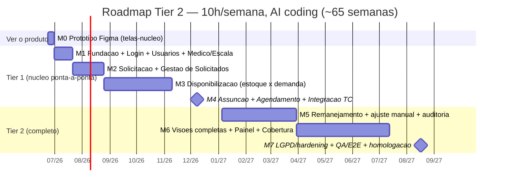

# 🗺️ Roadmap por Telas (para a Diretoria)

> A diretoria entende por **telas**, não por funcionalidades. Este doc traduz o backlog técnico
> (`01-spec-backlog.md`) em **telas** + um **roadmap incremental com checkpoint semanal**.
> O escopo formal (faz × não faz) continua em `02-scope-entrega-1.md`. Parâmetros: Tier 2, 10h/sem, AI coding.

## 🖥️ Inventário de Telas
| # | Tela | Papel principal | Tier | Milestone |
|---|------|-----------------|------|-----------|
| 1 | **Login** | Todos | T1 | M1 |
| 2 | **Gestão de Usuários** (papéis + escopo) | Admin | T1 | M1 |
| 3 | **Cadastro de Médico + Escala** | Admin/Demandas | T1 | M1 |
| 4 | **Solicitação** (governo: especialidade × qtd × mês) | Solicitante | T1 | M2 |
| 5 | **Gestão de Solicitados** | Admin/Demandas | T1 | M2 |
| 6 | **Disponibilização** (dashboard estoque × demanda; simular/reservar/emitir) | Admin/Demandas | T1 | M3 |
| 7 | **Assunção de Vagas** (assume + seleciona paciente + médico preferencial) | Gestor local | T1 | M4 |
| — | *(Agendamento → Teleconsulta: processo por trás da tela 7)* | — | T1 | M4 |
| 8 | **Remanejamento** (slots livres + redistribuição) | Admin/Demandas | T2 | M5 |
| 9 | **Ajuste manual de estoque** (retornos/extras + auditoria) | Admin/Demandas | T2 | M5 |
| 10 | **Painel/Visões** (macro, por governo, contratação) | Admin/Demandas | T2 | M6 |
| 11 | **Mapa de Cobertura** (+ "PDF Modelo") | Admin/Demandas | T2 | M6 |
| 12 | **Configurações** (especialidades, HCs, parâmetros) | Admin | T2 | M6 |
| 13 | **Auditoria / LGPD** | Admin | T2 | M7 |

## 📅 Roadmap (milestones — Tier 1 termina na M4, Tier 2 na M7)

| Milestone | Telas entregues | Semanas (~) | Marco |
|---|---|---|---|
| **M0** | Protótipo Figma navegável das telas-núcleo | 1 | Diretoria **vê o produto** |
| **M1** | 1·Login · 2·Usuários · 3·Médico+Escala (reais) | 2–4 | **"Algo funcionando em 4 semanas"** |
| **M2** | 4·Solicitação · 5·Gestão de Solicitados | 5–9 | Demanda entra no sistema |
| **M3** | 6·Disponibilização (a tela mais pesada) | 10–20 | Alocação funciona |
| **M4** | 7·Assunção + Agendamento → TC | 21–28 | 🏁 **Tier 1 completo** (agendamento real na TC) |
| **M5** | 8·Remanejamento · 9·Ajuste manual | 29–40 | Não-happy-paths |
| **M6** | 10·Painel · 11·Cobertura · 12·Configurações | 41–55 | Gestão completa |
| **M7** | 13·Auditoria/LGPD + hardening + homologação | 56–65 | 🏁 **Tier 2 completo** |

## ⏱️ Cadência de checkpoint semanal
Toda semana (sugestão: sexta), a diretoria recebe:
- **1 tela a mais** visível (protótipo Figma → ou versão real funcionando);
- o `STATUS.md` atualizado (que tela está em protótipo / real / testada);
- o que entra e o que **não** entra (sempre amarrado ao `02-scope-entrega-1.md`).

## 🎯 As 4 primeiras semanas (o que a diretoria quer ver)
| Semana | Entrega visível (checkpoint) |
|---|---|
| **S1** | **Protótipo Figma navegável** de ~6 telas-núcleo — a diretoria clica e vê o produto inteiro |
| **S2** | **Login + Gestão de Usuários** funcionando de verdade (sobre a fundação) |
| **S3** | **Cadastro de Médico + Escala** funcionando + estoque sendo calculado |
| **S4** | **Solicitação** começando + protótipo refinado das telas seguintes |

> ⚠️ **Nota honesta de capacidade:** a 10h/semana, "funcionando em 4 semanas" = **protótipo de TODAS
> as telas-núcleo (S1) + as 2–3 primeiras telas REAIS (S2–S4)**. Telas reais a mais nesse prazo exigem
> mais horas naquelas semanas. O protótipo Figma é o que garante o "ver tudo" rápido sem furar a capacidade.

## 💡 Por que protótipo Figma primeiro
- A diretoria **vê todas as telas em ~1 semana** (decisão visual rápida, antes de gastar horas em código).
- Validamos layout/fluxo barato; cada tela aprovada vira a spec da implementação real.
- Reaproveita o item #5 do projeto (Figma) e o Figma-to-code depois acelera o front.
