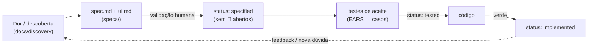
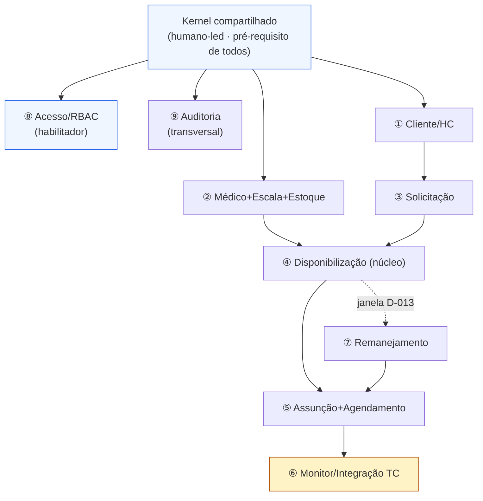

# 03 — SDD + TDD e Agentes de IA em Paralelo

> Como o **Spec-Driven + Test-Driven Development** opera neste projeto e como **vários agentes de IA
> trabalham em paralelo SEM quebrar a arquitetura**. Tudo aqui é **método**, não regra de negócio.
> Base: `CLAUDE.md` (Diretriz Suprema + princípios de risco), `docs/method/spec-first-hook.md`,
> `M-001..M-004` (`decisions-log.md`).

## 1. O ciclo SDD+TDD (spec → teste → código)

Estados da spec (M-001): **draft → specified → tested → implemented**. As `specs/*/ui.md` já existem
em `draft` (corretamente — têm perguntas abertas; `BUILD-PROGRESS.md`).

### Enforcement (a "máquina obriga o fluxo")
Os hooks desenhados em `docs/method/spec-first-hook.md` (a implementar quando a stack fechar — D-001):

1. **Sem spec validada ⇒ não codifica** (`PreToolUse` bloqueia Edit/Write de código sem `spec.md` `specified`).
2. **Teste antes do código** (TDD): sem teste correspondente ⇒ bloqueia.
3. **Não fechar sessão com árvore vermelha** (`Stop` roda a suíte).
4. **Anti-inferência**: não promover `draft→specified` com 🔴 aberto — **pergunte ao humano**
   (Diretriz Suprema, `CLAUDE.md`).

> Princípio de risco nº 1 (`CLAUDE.md`): a **spec e a suíte de testes são a ÚNICA verdade de campo**,
> não a sensação de progresso. O **núcleo crítico** (invariantes de `01-domain-model.md`: alocação,
> estoque, fairness/remanejamento) é **escrito/revisado por humano** e cercado de testes.

## 2. Como múltiplos agentes trabalham em paralelo sem quebrar a arquitetura

O risco de "N agentes mexendo no mesmo sistema" é **acoplamento acidental** e **deriva de regra**.
Cinco mecanismos contêm isso:

### 2.1 Um agente = dono de um módulo, atrás de um contrato testado
Cada agente é **dono de exatamente um bounded context** (`01-domain-model.md`). Ele só pode:
- editar **dentro** do seu módulo;
- consumir outros módulos **apenas pela porta/contrato** publicado (interface + testes de contrato);
- **nunca** tocar tabelas/internos de outro módulo.

Isso transforma "monólito modular" (`02-system-design.md` §1) em fronteiras que os agentes respeitam
por construção: o contrato é a fronteira de propriedade.

### 2.2 Kernel compartilhado (shared kernel) com guarda
IDs, especialidade, período/mês, HC/CNES, eventos de domínio e tipos LGPD vivem no **kernel**
(`01-domain-model.md` §1). Mudança no kernel é **rara e revisada por humano** (afeta todos) — agentes
de módulo **propõem**, humano aprova. Evita que um agente quebre os demais ao "ajustar um tipo".

### 2.3 Gates de CI (a arquitetura como teste automatizado)
- **Testes de contrato** entre módulos (a porta não pode mudar sem atualizar o teste do consumidor).
- **Teste de fronteira/dependência** (lint de import): proíbe `M5` importar internos de `M2` etc.
- **Suíte de aceite** derivada das EARS das specs (`*/ui.md` §7).
- **Segurança** (princípio de risco nº 2, `CLAUDE.md`): scanning de segredo em camadas,
  **zero segredo** em `.mcp.json`/settings, verificar todo pacote sugerido pela IA (≈20% podem ser
  inexistentes; IA dobra vazamento de segredo), least-privilege.
- **Verde obrigatório** antes de merge (hook `Stop` + CI).

### 2.4 Convenções de código
Ubiquitous Language do `glossary.md` (M-002), nomes de papéis/campos **só** se `✅ Confirmado`
(`CLAUDE.md`), lotes pequenos (princípio de risco nº 4). Convenção de pastas espelha os módulos →
`inferir_feature_do_caminho` do hook funciona.

### 2.5 UI guiada por design system (tokens + componentes)
Agentes de UI **não inventam** estilo: consomem `design/tokens.css`/`tokens.json` (fonte da verdade,
0 hex solto), os componentes de `design/components/`, e a **UI-spec por tela** (`specs/<tela>/ui.md`)
— layout, estados, responsivo (D-015), regras rastreadas (Dxxx). WCAG 2.2 AA (D-017), marca
tokenizada (D-016). Assim 14 telas podem ser construídas em paralelo com consistência total
(`BUILD-PROGRESS.md`).

## 3. Mapa de paralelização (que módulos vão em paralelo e dependências)

### Ordem e oportunidades de paralelismo

| Onda | Pode rodar em paralelo | Depende de | Observação |
|---|---|---|---|
| **0** | Kernel + RBAC + Design system/tokens | — | **Pré-requisito.** Kernel é humano-led (§2.2). |
| **1** | **① Cliente/HC** ∥ **② Médico+Escala+Estoque** | Kernel | independentes entre si — **2 agentes em paralelo**. |
| **2** | **③ Solicitação** (precisa ①) ∥ trabalho do **④** que só depende de ② (estoque) | ①, ② | ④ é o **núcleo crítico** → revisão humana reforçada das invariantes (INV-2/6). |
| **3** | **④ Disponibilização** fecha (junta demanda ③ × estoque ②) | ③, ② | gargalo de dependências — concentra revisão. |
| **4** | **⑤ Assunção+Agendamento** ∥ **⑦ Remanejamento** | ④ | ⑤ usa o Adapter TC; ⑦ usa a janela (D-013). |
| **5** | **⑥ Monitor/Integração** | ⑤ (e Adapter) | **🔴 bloqueado por regra**: prazo da janela e fonte do funil não definidos (`monitor-integracao/ui.md` §8) — não inferir. |
| **transversal** | **⑨ Auditoria** | engancha em todos | append-only; agentes emitem eventos, auditoria consome. |

**Regras do mapa:**
- Dois módulos só vão em paralelo se **não compartilham fronteira de escrita** e seus contratos já
  estão `specified`/`tested`.
- **④ Disponibilização** e **⑤ Assunção** carregam as invariantes médicas/financeiras
  (`01-domain-model.md` §3) → **humano no loop** (núcleo crítico à mão, `CLAUDE.md`).
- **⑥ Monitor** fica **parametrizável e parado na regra** até os 🔴 serem respondidos — agentes podem
  construir a casca (UI/funil/read-model) mas **não** o gatilho de prazo.

## 4. Anti-inferência aplicada aos agentes (Diretriz Suprema)

- Um agente que precise de uma regra **inexistente** **para e abre pergunta** em
  `docs/discovery/03-open-questions.md` — **não** decide no código (M-002, `CLAUDE.md`).
- Spec com 🔴 **não** vira `specified` (hook Regra 4). Logo o agente downstream **não** começa.
- Toda regra confirmada vira `D-xxx` em `decisions-log.md` antes de virar código.

## 5. Alinhamento com a Teleconsulta (método)

A TC **já pratica SDD** (monorepo com `/specs`, PRD-xxx; `04-integration-teleconsulta.md` §"visão
geral"; M-004). Nosso ciclo bate com o da empresa — o que facilita revisão cruzada do **Adapter de
Integração** (`02-system-design.md` §2) contra as specs da TC
(`specs/PRD-002-substituicao-absens/technical/api-contracts.md`) na hora de construir.

## 6. Perguntas abertas (método/processo)

- 🟡 Implementação real dos hooks depende da **stack** (DECISÃO ABERTA — D-001;
  `spec-first-hook.md` deixa explícito que é só o desenho).
- 🔴 Módulo ⑥ Monitor permanece bloqueado na regra da janela/fonte do funil
  (`monitor-integracao/ui.md` §8) — agentes não devem inferir.
