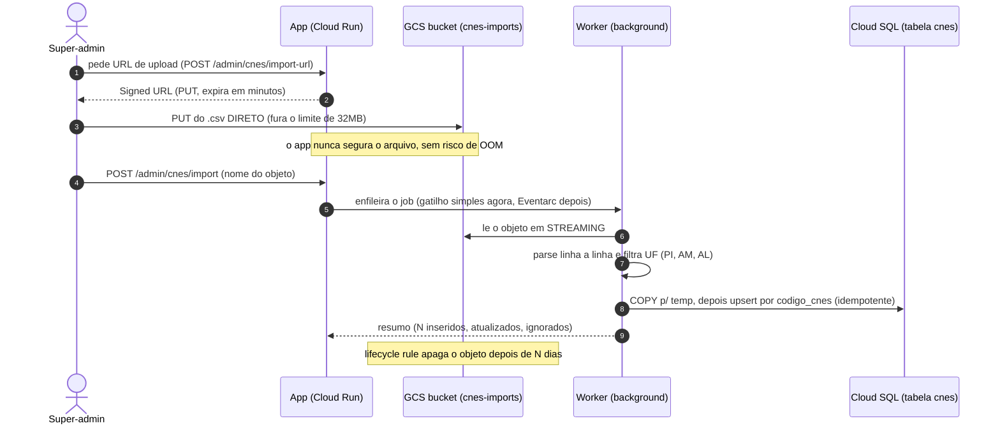

# 04 — Fluxos do sistema (visual)

> **Lar dos fluxos do sistema em diagrama** (pedido do Alessandro, 2026-07-13 — "seria legal ter
> diagramas explicando cada fluxo do sistema, algo bem visual"). Cada seção = um fluxo, com um
> diagrama **Mermaid** (renderiza no GitHub/preview). **Não cria regra** — cada fluxo rastreia a um
> `D-xxx`. Adicionar um fluxo novo aqui sempre que uma fatia/feature definir um caminho ponta a ponta.
>
> **Índice de fluxos:**
> - [Import de CNES (base pública → nossa tabela)](#import-de-cnes-fatia-3)  ·  D-215/D-219/D-221
> - _(próximos: carga inicial via profile_tags · agendamento → Unidade · gestão de unidades/grupos · …)_

---

## Import de CNES (fatia 3)

**O quê:** o super-admin sobe o `.csv` do CNES (base pública, DATASUS/API) e o sistema ingere na
**nossa tabela `cnes`** (cópia offline — D-219). Desenhado pra **arquivo grande** e **zero dependência
de runtime** da fonte externa. Decisões: [D-221](../decisions/decisions-log.md) (arquitetura),
D-215 (fonte pública), D-219 (cópia offline obrigatória).

**Por que assim (boas práticas ancoradas):** o Cloud Run tem **teto de 32MB por request** → o CSV não
pode passar pelo app; vai **direto pro bucket via Signed URL** (sem OOM no servidor). O processamento é
**assíncrono e em streaming** (não bloqueia request, não carrega tudo na RAM), e a carga em massa usa
**`COPY`** do Postgres (via Npgsql). O gatilho fica **simples agora** (job em background) e pode virar
**Eventarc → Cloud Run Job** depois, sem mexer no parser (fonte plugável).

**Notas de implementação (fatia 3):**
- **Fonte plugável** (`ICnesSource`): hoje um objeto no GCS; amanhã uma fonte-API alimenta o mesmo
  parser+upsert.
- **Idempotência:** upsert por `codigo_cnes` — re-subir o mesmo arquivo é seguro.
- **Infra a confirmar com a Portal:** a service account do Cloud Run precisa de
  `roles/iam.serviceAccountTokenCreator` pra assinar a URL; lifecycle rule no bucket `cnes-imports`.
- **Carga inicial** (profile_tags da TC, D-219) é um fluxo à parte, mas reusa o mesmo upsert.

_Fontes de boas práticas: limite de 32MB do Cloud Run + Signed URL (dev.to, Google Cloud Blog);
CSV grande no GCP (Google Dev forums); COPY no Npgsql (docs oficiais) — links no chat de 2026-07-13._
