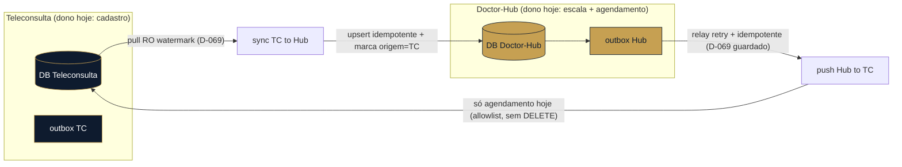

# 05 — Sync bidirecional Teleconsulta ⇄ Doctor-Hub (blueprint)

> **Objetivo (D-209):** os dois sistemas usados JUNTOS, um refletindo o outro, com o Doctor-Hub
> **assumindo aos poucos** cada pedaço da Teleconsulta. Este doc é o **blueprint** para chegar lá
> **sem** cair na armadilha do "merge simétrico" (o anti-padrão que dá loop de eco + conflito +
> drift). Não é um lote a construir de uma vez — é o mapa pra construir por partes.

## 0. A regra de ouro: NÃO fazer merge simétrico

Sync simétrico de verdade (mesmo registro editável dos dois lados, "quem ganha?") é dos problemas
mais difíceis de sistemas distribuídos. A forma **mais resiliente** não é resolver o conflito — é
**evitá-lo por design**, com **dono por entidade**.

## 1. Dono por entidade (a peça-chave)

Cada entidade tem **UM dono** (fonte de verdade) e o sync é **um-sentido, a partir do dono**.
"Bidirecional" vira um **conjunto de fluxos um-sentido** — cada um trivial de raciocinar. Conforme o
Doctor-Hub **assume** uma entidade (D-209), **vira-se a direção** dela (o dono muda) — nunca há dois
donos ao mesmo tempo.

| Entidade | Dono HOJE | Direção do sync | Vira p/ Doctor-Hub quando… |
|---|---|---|---|
| **HealthCenter → Cliente** | Teleconsulta | TC → Hub (pull RO, D-225) | o cadastro de cliente centralizar no Hub |
| **Unidade / Grupo** | Teleconsulta (bootstrap) | TC → Hub **uma vez** (D-226); depois o Hub é dono | já é: pós-bootstrap o cliente cria/gere no Hub |
| **Doutor (cadastro)** | **em transição → Hub** (D-229) | **two-way** (real) durante a transição | quando a TC for desligada |
| **Paciente (cadastro)** | **em transição → Hub** (D-229) | **two-way** (real) durante a transição | quando a TC for desligada |
| **Escala / capacidade** | Doctor-Hub | (interno do Hub) | já é do Hub |
| **Agendamento** | Doctor-Hub | Hub → TC (push guardado, D-069/D-192) | já é do Hub |

**Leitura:** hoje quase tudo é **TC → Hub** (pull RO, mansa); o único **Hub → TC** é o **agendamento**
(push, perigosa — §4). Two-way real só aparece na transição de um dono pro outro, e mesmo aí é
**um-sentido de cada vez** (o dono muda, a direção vira).

## 2. A receita de resiliência (por fluxo)

Cada fluxo um-sentido usa a mesma espinha:

1. **Outbox transacional** — toda escrita numa tabela de negócio grava, na **MESMA transação**, um
   evento numa tabela `outbox`. Atômico: ou grava os dois, ou nenhum. *(Já existe na casa: o
   `AgendamentoOutbox`, D-192/193 — generalizar o padrão.)*
2. **Relay assíncrono** — um worker lê o outbox e entrega no outro lado com **retry + backoff +
   dead-letter + confirmação**. Entrega mesmo com o outro lado fora do ar (recupera quando volta).
3. **Marca de origem (anti-eco)** — toda escrita feita PELO sync carrega `origem`/`source_system` +
   a versão de origem. O lado que recebe **não re-emite** o que ele mesmo aplicou. **Sem isso,
   two-way vira ping-pong infinito** — é o item que mais gente esquece.
4. **Idempotência por chave estável + versão** — chave = o `external_id` (o `patient_id`/`doctor_id`
   da TC) + `updated_at`/versão. Entrega **at-least-once** + aplicar idempotente = efeito
   "exactly-once". Re-entregar não duplica nem regride.
5. **Conflito (só no resíduo two-way):** com dono-por-entidade some ~90%. No resto, **Last-Write-Wins
   por versão/`updated_at`** com a marca de origem no desempate; e uma **fila de conflito** pra
   revisão HUMANA no que for dado clínico/sensível (nunca resolver no chute — Diretriz Suprema).

## 3. Diagrama (fluxos por dono)

## 4. As duas direções têm posturas de segurança DIFERENTES

- **TC → Hub (pull):** **read-only** (D-069). Mansa. É o que os lotes D-225/D-226/D-227 constroem.
  Nunca escreve na TC.
- **Hub → TC (push):** **perigosa** (D-069). Credencial dedicada + **allowlist tabela:coluna** +
  dry-run + `--apply` + log; **nunca** DELETE/DROP/TRUNCATE; UPDATE **sempre** com WHERE por
  `external_id`. Toda ampliação do push (além do agendamento) passa por confirmação humana do
  mapeamento campo→tabela:coluna.

## 5. Paciente e doutor: cadastro em transição, dado REAL, two-way (D-229)

**Revoga o modelo anterior** (pseudonimização do D-227): o Hub **assume o cadastro** de paciente e
doutor (D-209 concretizado). Durante a transição, os **dois** sistemas gerenciam, com **dado REAL,
sem anonimizar** — porque (a) a diretoria da TC + demandas médicas **validam** que o dado puxado
está correto, e (b) editar no Hub tem que **voltar** pra TC (ex.: "Maria Silva da Costa" →
"…Machado"), e dado fake não volta. Logo é **two-way real** — o resíduo que a §1-2 endereça (outbox
+ marca-de-origem + LWW). A âncora de identidade é o `external_id` = **`patient_id`/`doctor_id`** da
TC. **LGPD (não relaxa):** dado real no banco, mas **logs/respostas só com INICIAIS** ("Maria S."),
least-privilege, auditoria. View de validação com dado completo = acesso controlado + auditado.

## 6. Transporte: carga inicial + event-driven (D-229)

Evolução confirmada (D-229 — o Hub vira dono do cadastro): **carga inicial (bootstrap)** + **sync
contínuo event-driven**. A escolha do transporte:

- **Pub/Sub (GCP) — RECOMENDADO.** Os dois são GCP → managed, durável, at-least-once, dead-letter,
  sem broker pra operar. Integra com Cloud Run (push sub chama seu endpoint; pull sub = worker puxa).
- **Kafka** = overkill (log replayável / alta vazão que cadastro não precisa). **RabbitMQ** = um
  broker a mais pra rodar. **Webhook puro** = at-most-once (perde evento se o destino cai) — só serve
  como *gatilho*, SEMPRE atrás de um outbox.

**A durabilidade NÃO vem do transporte — vem do OUTBOX.** Qualquer que seja o barramento:
- **Hub → TC:** o Hub tem **outbox transacional** (reusa `AgendamentoOutbox`) → relay publica no
  Pub/Sub → consumidor faz a **escrita guardada** na TC (D-069). Você controla o código dos dois lados.
- **TC → Hub:** a TC é legada (não queremos mexer no código dela). Duas opções:
  - **CDC gerenciado — `Datastream` (GCP)** lê o WAL do Postgres da TC → Pub/Sub → consumidor no Hub.
    Near-real-time, **sem tocar no código da TC**. É o "webhook confiável" que você quer, GCP-native.
  - **Poll por watermark** (o que já construí) como interino/simples, até ligar o CDC.
- **Sempre:** consumidor **idempotente** (dedup por event-id / `external_id`+versão) + **marca de
  origem** (anti-eco — não re-emite o que aplicou) + **DLQ**.

**Recomendação:** carga inicial (bootstrap, já feito) → Pub/Sub como barramento → Hub emite via
outbox, TC emite via **Datastream (CDC)** → consumidores idempotentes com marca-de-origem + DLQ.
Nada de Kafka/RabbitMQ. Constrói-se por entidade.

## 7. Resumo executável

**Dono-por-entidade (um-sentido a partir do dono) + outbox transacional + relay com
retry/idempotência/dead-letter + marca de origem (anti-eco) + LWW-por-versão só no resíduo.**
Reusa o `AgendamentoOutbox` existente, honra o D-069 (push guardado) e o D-209 (vira a direção
conforme o Hub assume cada entidade). Constrói-se **por entidade**, não de uma vez — e nunca vira o
monstro do merge simétrico.
