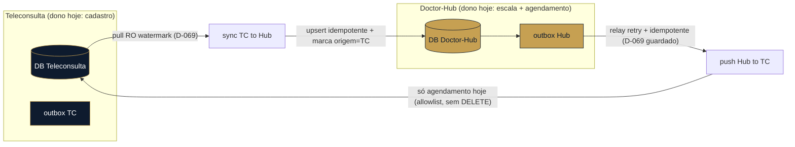

# 05 — Sync bidirecional Teleconsulta ⇄ Doctor-Hub (blueprint)

> **Objetivo (D-209):** os dois sistemas usados JUNTOS, um refletindo o outro, com o Doctor-Hub
> **assumindo aos poucos** cada pedaço da Teleconsulta. Este doc é o **blueprint** para chegar lá
> **sem** cair na armadilha do "merge simétrico" (o anti-padrão que dá loop de eco + conflito +
> drift). Não é um lote a construir de uma vez — é o mapa pra construir por partes.

## 0. A regra de ouro: NÃO fazer merge simétrico

Sync simétrico de verdade (mesmo registro editável dos dois lados, "quem ganha?") é dos problemas
mais difíceis de sistemas distribuídos. A forma **mais resiliente** não é resolver o conflito — é
**evitá-lo por design**, com **dono por entidade**.

## 1. Dono por entidade (a peça-chave)

Cada entidade tem **UM dono** (fonte de verdade) e o sync é **um-sentido, a partir do dono**.
"Bidirecional" vira um **conjunto de fluxos um-sentido** — cada um trivial de raciocinar. Conforme o
Doctor-Hub **assume** uma entidade (D-209), **vira-se a direção** dela (o dono muda) — nunca há dois
donos ao mesmo tempo.

| Entidade | Dono HOJE | Direção do sync | Vira p/ Doctor-Hub quando… |
|---|---|---|---|
| **HealthCenter → Cliente** | Teleconsulta | TC → Hub (pull RO, D-225) | o cadastro de cliente centralizar no Hub |
| **Unidade / Grupo** | Teleconsulta (bootstrap) | TC → Hub **uma vez** (D-226); depois o Hub é dono | já é: pós-bootstrap o cliente cria/gere no Hub |
| **Doutor** | Teleconsulta | TC → Hub (pull RO, D-069/D-133) | o cadastro-dono do médico virar no Hub (Fase 1 do roadmap) |
| **Paciente (identidade)** | Teleconsulta | TC → Hub (pull RO, D-212/D-227) — **fictício no Hub** | o Hub for dono do dado REAL (EMPI real) — HOJE fica **um-sentido** (ver §5) |
| **Escala / capacidade** | Doctor-Hub | (interno do Hub) | já é do Hub |
| **Agendamento** | Doctor-Hub | Hub → TC (push guardado, D-069/D-192) | já é do Hub |

**Leitura:** hoje quase tudo é **TC → Hub** (pull RO, mansa); o único **Hub → TC** é o **agendamento**
(push, perigosa — §4). Two-way real só aparece na transição de um dono pro outro, e mesmo aí é
**um-sentido de cada vez** (o dono muda, a direção vira).

## 2. A receita de resiliência (por fluxo)

Cada fluxo um-sentido usa a mesma espinha:

1. **Outbox transacional** — toda escrita numa tabela de negócio grava, na **MESMA transação**, um
   evento numa tabela `outbox`. Atômico: ou grava os dois, ou nenhum. *(Já existe na casa: o
   `AgendamentoOutbox`, D-192/193 — generalizar o padrão.)*
2. **Relay assíncrono** — um worker lê o outbox e entrega no outro lado com **retry + backoff +
   dead-letter + confirmação**. Entrega mesmo com o outro lado fora do ar (recupera quando volta).
3. **Marca de origem (anti-eco)** — toda escrita feita PELO sync carrega `origem`/`source_system` +
   a versão de origem. O lado que recebe **não re-emite** o que ele mesmo aplicou. **Sem isso,
   two-way vira ping-pong infinito** — é o item que mais gente esquece.
4. **Idempotência por chave estável + versão** — chave = o `external_id` (o `patient_id`/`doctor_id`
   da TC) + `updated_at`/versão. Entrega **at-least-once** + aplicar idempotente = efeito
   "exactly-once". Re-entregar não duplica nem regride.
5. **Conflito (só no resíduo two-way):** com dono-por-entidade some ~90%. No resto, **Last-Write-Wins
   por versão/`updated_at`** com a marca de origem no desempate; e uma **fila de conflito** pra
   revisão HUMANA no que for dado clínico/sensível (nunca resolver no chute — Diretriz Suprema).

## 3. Diagrama (fluxos por dono)

## 4. As duas direções têm posturas de segurança DIFERENTES

- **TC → Hub (pull):** **read-only** (D-069). Mansa. É o que os lotes D-225/D-226/D-227 constroem.
  Nunca escreve na TC.
- **Hub → TC (push):** **perigosa** (D-069). Credencial dedicada + **allowlist tabela:coluna** +
  dry-run + `--apply` + log; **nunca** DELETE/DROP/TRUNCATE; UPDATE **sempre** com WHERE por
  `external_id`. Toda ampliação do push (além do agendamento) passa por confirmação humana do
  mapeamento campo→tabela:coluna.

## 5. Ressalva do PACIENTE (importante)

O paciente é **um-sentido (TC → Hub) hoje, e tem que continuar**, enquanto o Hub guarda **CPF/nome
FICTÍCIOS** (D-227 — o dado real não é lido da TC por LGPD). Empurrar isso de volta **corromperia a
TC com dado fake**. A direção **Hub → TC de paciente fica DESLIGADA de propósito** até o Hub ser
dono do dado REAL (EMPI real, D-209 futuro). A âncora de identidade que sobrevive à transição é o
`external_id` = **`patient_id`** da TC (decisão do Alessandro, 2026-07-15).

## 6. Quando CDC entra (futuro)

O que existe é **pull por watermark (polling)** — simples e resiliente, bom pra "reflete a cada N
minutos". Se o negócio pedir **near-real-time** ("mudou lá, reflete aqui em segundos"), o próximo
nível é **CDC** (logical replication do Postgres / Debezium lendo o WAL) alimentando o **mesmo**
outbox/relay. Mais infra — só quando justificar. Não é pré-requisito da bidirecional.

## 7. Resumo executável

**Dono-por-entidade (um-sentido a partir do dono) + outbox transacional + relay com
retry/idempotência/dead-letter + marca de origem (anti-eco) + LWW-por-versão só no resíduo.**
Reusa o `AgendamentoOutbox` existente, honra o D-069 (push guardado) e o D-209 (vira a direção
conforme o Hub assume cada entidade). Constrói-se **por entidade**, não de uma vez — e nunca vira o
monstro do merge simétrico.
