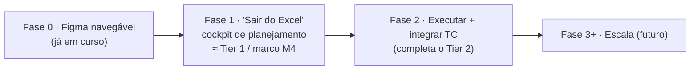
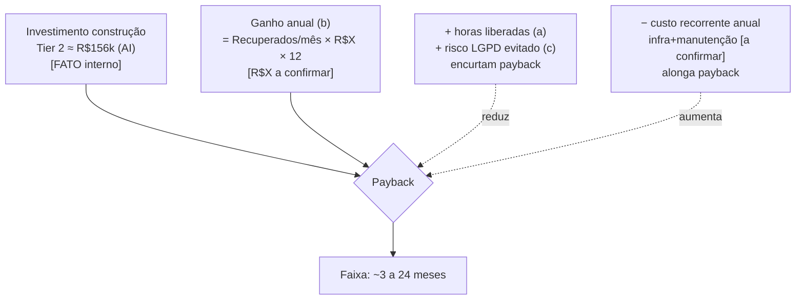

# Análise de Custo & ROI

> ⚠️ **Como ler este documento.** Os números de **custo de construção** vêm de estimativas já
> consolidadas no repo (esforço, preço, AI vs. normal) e dos **fatos de billing de IA** do
> relatório de pesquisa — estão **citados**. Os números de **ROI** dependem de **dados de
> receita do cliente que ainda NÃO temos**: por isso todo valor financeiro de retorno usa
> **placeholders rotulados** (`R$X`, `N`) e **tabelas de sensibilidade** que você ajusta. Tudo
> que é premissa ilustrativa está marcado **[PREMISSA ILUSTRATIVA]**; tudo que é fato verificável
> está **[FATO]** com fonte. Não inventamos a receita do cliente.

---

## 0. BIG NUMBERS (resumo para a diretoria)

> Os "ganhos" abaixo usam premissas ilustrativas marcadas (ver §2 e §4). **Não são receita confirmada.**

| Pergunta | Resposta em faixa | Base |
|---|---|---|
| **Custo de construir (Entrega 1, Tier 2, AI coding)** | **≈ R$150k–160k** (preço c/ 25% contingência) | `05-estimativa-normal-vs-ai.md` [FATO interno] |
| **Custo só de IA/infra (pass-through, Tier 2)** | **≈ R$4,4k–10k** (mão de obra domina) | `04-custo-e-proposta.md` [FATO interno] |
| **Economia do AI coding vs. tradicional** | **≈ R$50k e ~5 meses** no Tier 2 | `05-estimativa-normal-vs-ai.md` [FATO interno] |
| **Horas/mês de pessoas liberadas do Excel** | **≈ 65–325 h/mês** (1–2 pessoas) | §2 [PREMISSA ILUSTRATIVA] |
| **Perda hoje recuperável (janela expirada)** | **7,7% dos agendamentos/mês** (420 de 5.448) | `05-processo-manual-excel.md` [FATO] |
| **Payback** | **≈ 6–24 meses** conforme valor/atendimento e % de perda recuperada | §3 [DEPENDE de R$X] |

**A frase para a diretoria:** *construir custa ~R$150k em ~15 meses a 10h/sem (ou ~R$79k/Tier 1 em
~7,5 meses); o retorno depende de dois números do cliente que precisamos confirmar — o valor médio por
atendimento e quantos dos 7,7% perdidos/mês conseguimos recuperar. Abaixo está a fórmula e a tabela para
preencher esses dois números e ver o payback.*

---

## 1. Custo de construção (por fase, AI coding vs. tradicional)

### 1.1 Esforço e preço por tier — [FATO interno, citado]

Fonte: `docs/product/03-estimativa-esforco.md`, `04-custo-e-proposta.md`, `05-estimativa-normal-vs-ai.md`.
Parâmetros confirmados pelo Alessandro (2026-06-14): **valor/hora R$180**, **10h úteis/semana**,
**contingência 25%**, câmbio **US$1≈R$5,50 (a verificar)**.

> ⚠️ Estamos no fim da Descoberta → "cone de incerteza": faixa **−20% a +35%** nas horas. As horas do
> backlog já foram estimadas como **1 dev + IA** (= coluna "AI coding"). "Desenvolvimento normal" (sem IA)
> = AI coding **+35%** (faixa +25% a +45%) — **este delta é o número mais incerto** de toda a estimativa
> (a IA economiza em telas/infra, pouco no motor de alocação) `[05-estimativa-normal-vs-ai.md]`.

| Escopo | Horas (AI) | Horas (Normal +35%) | Preço AI ≈ | Preço Normal ≈ | Prazo a 10h/sem (AI) |
|---|---|---|---|---|---|
| 🟢 **Tier 1** (cockpit "sair do Excel") | ~330h | ~445h | **~R$79.000** | ~R$105.000 | ~33 sem (**~7,5 meses**) |
| 🟡 **Tier 2** (Entrega 1 completa) | ~650h | ~880h | **~R$156.000** | ~R$208.000 | ~65 sem (**~15 meses**) |

`Preço = horas × R$180 × 1,25 + pass-through` `[04-custo-e-proposta.md]`.

**Leitura para diretoria:** AI coding economiza **~R$50k e ~5 meses no Tier 2**, mas a economia vem das
telas/infra, **não** do motor de alocação `[05-estimativa-normal-vs-ai.md]`. A **dedicação semanal** é a
maior alavanca de prazo — muito mais que AI vs. normal.

### 1.2 Mapa fase → escopo

Fonte: `docs/product/07-fases-entrega.md`, decisão `D-014`.



> **Nota de reconciliação (`D-014`):** o escopo contratado é **Tier 2**, entregue incremental por tela; o
> **Tier 1 é um marco interno (M4)** já demonstrável/faturável no meio da jornada. As "3 semanas / 6 semanas"
> de `07-fases-entrega.md` são **fases de capacidade**, não promessa de relógio a 10h/sem.

### 1.3 Custo de tokens / assinatura de IA (pass-through) — [FATO, citado do relatório de pesquisa]

A **mão de obra domina**; IA + infra são pequenos `[04-custo-e-proposta.md]`. Fatos de billing
(`docs/method/ai-coding-sdd-report.md`, §7, recuperados 2026-06-14):

- **[FATO]** Médias oficiais de uso de Claude Code: **~US$13/dev/dia ativo**, **~US$150–250/dev/mês**, 90%
  abaixo de US$30/dia `[ai-coding-sdd-report §7.3, code.claude.com/docs/en/costs]`.
- **[FATO]** Assinatura que cobre Claude Code **interativo**: **Max 5x a partir de US$100/mês**; uso pesado
  pode exigir **Max 20x (~US$200/mês — a verificar)** `[ai-coding-sdd-report §7.1, claude.com/pricing]`.
- **[FATO — decisão D-007 + mudança de billing 15/06/2026]** Na Entrega 1 usamos **só o modo interativo →
  fica na assinatura**. Automação via **Agent SDK / `claude -p` / GitHub Actions** sairia da assinatura e
  consumiria **créditos a preço de API** a partir de **15/06/2026** `[ai-coding-sdd-report §7.1(c),
  suporte oficial Anthropic; D-007]`. **Por isso o pass-through fica baixo e previsível.**
- **[FATO]** Preço de API (se algum dia automatizar), por MTok USD: **Opus 4.8** input US$5 / output US$25
  (cache read US$0,50); **Sonnet 4.6** US$3 / US$15; **Haiku 4.5** US$1 / US$5; caching automático no
  Claude Code dá ~90% de desconto no hit `[ai-coding-sdd-report §7.2, platform.claude.com]`. *Caveat do
  relatório: Opus 4.7+ podem usar ~35% mais tokens para o mesmo texto.*

**Pass-through total por tier** (assinatura interativa + infra modesta) `[04-custo-e-proposta.md]`:

| Tier (duração ~) | IA (assinatura) | Infra | **Pass-through total (faixa)** |
|---|---|---|---|
| 🟢 Tier 1 (~2–4 meses de relógio) | US$300–600 | US$90–320 | **≈ US$400–900 (R$2,2k–5,0k)** |
| 🟡 Tier 2 (~4–8 meses de relógio) | US$600–1.200 | US$180–640 | **≈ US$800–1,8k (R$4,4k–10k)** |

> ⚠️ A duração de relógio do pass-through (2–8 meses) é a de `04-custo-e-proposta.md`; a 10h/semana o
> **prazo** se estende (Tier 2 ≈ 15 meses), o que **alonga a assinatura** — mesmo assim o pass-through
> total continua **desprezível frente à mão de obra** (R$4,4k–10k vs. ~R$156k). Premissa: ~US$100–200/mês
> de assinatura ao longo do projeto.

### 1.4 Custo total de construção — visão consolidada

| Componente | Tier 1 (AI) | Tier 2 (AI) | Fonte |
|---|---|---|---|
| Mão de obra (330/650h × R$180) | R$59.400 | R$117.000 | `04-custo-e-proposta.md` [FATO interno] |
| Contingência 25% | +R$14.850 | +R$29.250 | idem |
| Pass-through IA+infra (topo) | +R$5.000 | +R$10.000 | §1.3 [FATO] |
| **Preço total ≈** | **~R$79.000** | **~R$156.000** | `05-estimativa-normal-vs-ai.md` |

> **Observação honesta de custo:** "preço" aqui inclui contingência e (se for revenda) sua margem; é
> **custo de aquisição do sistema para quem investe**, não custo marginal de operação. O custo recorrente
> pós-entrega (infra + manutenção) **não foi estimado nos docs-fonte** → ver §4 "Premissas a confirmar".

---

## 2. ROI de tirar a operação do Excel

> **O QUE TEMOS (fato) vs. O QUE FALTA (placeholder).**
> **[FATO]** o processo manual e a perda de 7,7% (`docs/discovery/05-processo-manual-excel.md`).
> **[FALTA]** o **valor financeiro** por atendimento e o **custo/hora** das funcionárias — sem isso não há
> R$ de retorno, só horas e percentuais. Por isso esta seção entrega **fórmulas + sensibilidade**, não um
> número único de ROI.

### 2.1 O que o Excel custa hoje — [FATO, citado]

Fonte: `docs/discovery/05-processo-manual-excel.md` e decisão `D-019`.

- **[FATO/D-019]** O controle de demanda vive em planilhas Excel (`agenda-operacional-*.xlsx`) mantidas por
  **1-2 funcionárias, horas por dia, fora de qualquer sistema**.
- **[FATO]** O trabalho manual é **monitoramento, conferência e triagem de exceções**: exportar a planilha
  do hub várias vezes ao dia, ler painéis, varrer abas-dia procurando `Sem médico`/`Revisão`, trabalhar a
  fila `Recuperáveis` antes que vire `Perdidos`.
- **[FATO]** **Snapshots descartáveis sem histórico/diff** (947→1547 agendamentos em 2 dias; o operador
  compara de cabeça). **Sem visão prévia de oferta vs. demanda** (capacidade só aparece *depois* do estouro).
- **[FATO — a dor mensurável]** **Perda por janela expirada = 7,7%/mês** → **420 de 5.448** agendamentos
  capturados num mês não chegaram a ser integrados a tempo (`Status=Janela perdida`, até 15 tentativas).
- **[FATO — risco]** Dados pessoais de paciente (**CNS, telefone, nascimento**) trafegando em **planilha
  Excel local** → **risco LGPD inerente** ao controle por arquivo.

### 2.2 Benefício (a) — horas/mês liberadas das funcionárias

**Fórmula:**
```
Horas liberadas/mês = N_pessoas × H_horas_por_dia × D_dias_uteis_mes × R_reducao
Economia R$/mês      = Horas liberadas/mês × C_custo_hora_funcionaria
```

**[PREMISSA ILUSTRATIVA]** valores plausíveis (ajuste com RH/operação):

| Parâmetro | Símbolo | Faixa ilustrativa | Origem |
|---|---|---|---|
| Pessoas no controle manual | `N_pessoas` | **1 a 2** | [FATO] `D-019` |
| Horas/dia por pessoa no Excel | `H_horas_por_dia` | **2 a 4 h** | [PREMISSA] ("horas por dia" em D-019) |
| Dias úteis/mês | `D_dias_uteis_mes` | **~22** | [PREMISSA] padrão |
| Redução pelo sistema | `R_reducao` | **40% a 70%** | [PREMISSA] (sistema antecipa exceção, mas não zera supervisão) |
| Custo/hora carregado da funcionária | `C_custo_hora` | **R$X** (placeholder) | **[A CONFIRMAR]** |

**Faixa de horas liberadas/mês** (antes de aplicar `C_custo_hora`):

| Cenário | Cálculo | Horas liberadas/mês |
|---|---|---|
| Conservador (1 pessoa, 2h/dia, 40%) | 1×2×22×0,40 | **~18 h/mês** |
| Central (1,5 pessoa, 3h/dia, 55%) | 1,5×3×22×0,55 | **~54 h/mês** |
| Otimista (2 pessoas, 4h/dia, 70%) | 2×4×22×0,70 | **~123 h/mês** |

> ⚠️ Faixa ampla de propósito: **18 a 123 h/mês**. O texto-fonte diz "1-2 pessoas, horas/dia" sem precisar.
> O `BIG NUMBERS` cita 65–325 h/mês como teto bruto (sem aplicar `R_reducao`); aplicando a redução realista,
> a faixa **economizável** é a desta tabela. Para virar R$, multiplique por `C_custo_hora = R$X`.

### 2.3 Benefício (b) — recuperar os 7,7% de agendamentos perdidos (valor/receita)

Este é o benefício de **maior alavancagem** e o **único com base [FATO]** no volume.

**Fórmula:**
```
Perdidos/mês          = V_volume_mensal × 7,7%
Recuperáveis/mês      = Perdidos/mês × P_pct_recuperavel_pelo_sistema
Valor recuperado/mês  = Recuperáveis/mês × R$X_valor_por_atendimento
```

**Parâmetros:**

| Parâmetro | Símbolo | Valor | Origem |
|---|---|---|---|
| Volume capturado/mês (amostra) | `V_volume_mensal` | **5.448** | [FATO] `dashboard-30d` (03/05–02/06) |
| % perdido por janela expirada | — | **7,7%** (=420) | [FATO] `05-processo-manual-excel.md` |
| % desses perdidos que o sistema recupera | `P_pct_recuperavel` | **20% a 60%** | [PREMISSA] (o sistema antecipa a janela com alerta+SLA; não recupera 100%) |
| Valor médio por atendimento | `R$X` | **R$X** (placeholder) | **[A CONFIRMAR — não inventado]** |

> **Por que `P` não é 100%:** o sistema converte monitoramento reativo em alerta proativo com SLA (edital =
> 15 dias agendamento→atendimento) `[05-processo-manual-excel.md §7]`, mas parte da perda vem de causas fora
> do nosso controle (dados do paciente, mapeamentos, capacidade real estourada). **20–60% é prudente.**

**Agendamentos recuperados/mês** (independente de R$X):

| `P_pct_recuperavel` | Recuperados/mês (de 420) |
|---|---|
| 20% | ~84 |
| 40% | ~168 |
| 60% | ~252 |

**Valor recuperado/mês = Recuperados/mês × R$X** → preencher na §2.6.

> **Enquadramento honesto:** se o cliente é **público/SUS**, "valor por atendimento" pode ser **repasse/custo
> evitado** e não "receita" no sentido comercial — a fórmula é a mesma, mas o **rótulo de R$X muda** (receita,
> repasse, ou custo de oportunidade). **Não assumimos qual é.**

### 2.4 Benefício (c) — ciclo mais rápido, menos erros, menos risco LGPD

Benefícios reais mas **mais difíceis de monetizar** → tratados como **qualitativos + um proxy**.

| Benefício | Evidência [FATO] | Como entra no ROI |
|---|---|---|
| **Ciclo mais rápido / menos erro** | Hoje: snapshots sem diff, varredura manual de centenas de linhas, capacidade só vista após estouro | Parte já capturada em (a) horas e (b) perdas evitadas; **evita dupla contagem** |
| **Menos risco LGPD** | CNS/telefone/nascimento em **Excel local**; sistema põe dado sob base legal/auditoria; `D-012` reduz exposição (master de paciente é da TC) | **Redução de risco**, não fluxo de caixa. Proxy: custo esperado = `Prob_incidente × Multa_LGPD_R$Y`. **`Multa` é placeholder [A CONFIRMAR]** — LGPD permite multa até 2% do faturamento, teto R$50M/infração (não citável dos docs-fonte; confirmar com jurídico) |
| **Auditabilidade / governança** | Decisão registrada e exportável substitui `agenda-operacional.xlsx` `[07-fases-entrega.md]` | Qualitativo (vendabilidade p/ healthcare/governo) |

> **Regra anti-dupla-contagem:** o "ciclo mais rápido" já se manifesta em **(a) horas** e **(b) perdas
> evitadas**. Não o some como terceira linha de R$ — conte-o como **qualitativo** + o proxy de LGPD.

### 2.5 Benefício anualizado — fórmula consolidada

```
Ganho anual ≈ 12 × [ (Horas_liberadas_mes × C_custo_hora)            ← benefício (a)
                    + (Recuperados_mes × R$X_valor_por_atendimento) ← benefício (b)
                    ]
              + (Prob_incidente_LGPD × Multa_R$Y) evitado/ano         ← benefício (c), proxy
```

### 2.6 Tabela de sensibilidade — VALOR RECUPERADO/ano (benefício b)

> **Você preenche `R$X` (valor por atendimento).** Linhas = quanto da perda o sistema recupera; colunas =
> `R$X`. Células = **ganho anual** do benefício (b) = `Recuperados/mês × R$X × 12`.

| `P` recuperação ↓ / `R$X` → | R$50 | R$100 | R$200 | R$400 |
|---|---|---|---|---|
| **20%** (~84/mês) | R$50,4k | R$100,8k | R$201,6k | R$403,2k |
| **40%** (~168/mês) | R$100,8k | R$201,6k | R$403,2k | R$806,4k |
| **60%** (~252/mês) | R$151,2k | R$302,4k | R$604,8k | R$1.209,6k |

*(Cálculo: ex. 168/mês × R$200 × 12 = R$403,2k/ano. Volume base = 5.448/mês × 7,7% = 420 perdidos/mês.)*

> ⚠️ **Estes não são lucros confirmados.** São o que **um** dos benefícios renderia **se** `R$X` e `P`
> forem os indicados. `R$X` é placeholder. Se o volume mensal real for diferente de 5.448, reescale
> proporcionalmente.

### 2.7 Tabela de sensibilidade — HORAS liberadas/ano (benefício a)

> Você preenche `C_custo_hora = R$X`. Células = `Horas_liberadas/mês × 12 × C_custo_hora`.

| Horas liberadas/mês ↓ / `C_custo_hora` → | R$30 | R$50 | R$80 |
|---|---|---|---|
| **18 h** (conservador) | R$6,5k | R$10,8k | R$17,3k |
| **54 h** (central) | R$19,4k | R$32,4k | R$51,8k |
| **123 h** (otimista) | R$44,3k | R$73,8k | R$118,1k |

> Benefício (a) tende a ser **menor** que (b) — a maior alavanca financeira é **recuperar agendamentos
> perdidos**, não economizar horas de planilha.

---

## 3. Payback e ROI (em faixas)

**Fórmulas:**
```
Investimento (ano 1)  = Custo de construção (§1.4) + Custo recorrente anual (infra+manutenção, [A CONFIRMAR])
Ganho anual           = §2.5
Payback (meses)       = Investimento / (Ganho anual / 12)
ROI % (ano 1)         = (Ganho anual − Custo recorrente − amortização) / Investimento × 100
```

**Cenário trabalhado** — Tier 2 AI = **R$156k** de construção `[FATO interno]`, ignorando recorrente por ora
(marcado a confirmar), e contando **só o benefício (b)** (o de base factual). Payback = `156.000 / (Ganho_b/12)`:

| Ganho anual (b), de §2.6 | Ganho/mês | **Payback (Tier 2, R$156k)** | **Payback (Tier 1, R$79k)** |
|---|---|---|---|
| R$100k/ano | ~R$8,3k | **~19 meses** | **~9,5 meses** |
| R$200k/ano | ~R$16,7k | **~9,4 meses** | **~4,7 meses** |
| R$400k/ano | ~R$33,3k | **~4,7 meses** | **~2,4 meses** |
| R$600k/ano | ~R$50k | **~3,1 meses** | **~1,6 meses** |

**ROI % ano 1** (Tier 2, só benefício b, sem recorrente): `(Ganho − 156k)/156k`:

| Ganho anual (b) | ROI ano 1 (Tier 2) |
|---|---|
| R$100k | **−36%** (não paga no 1º ano) |
| R$200k | **+28%** |
| R$400k | **+156%** |
| R$600k | **+285%** |

> **Faixa honesta de payback:** **≈ 3 a 24 meses** para Tier 2, dependendo quase inteiramente de **R$X** e
> de **quanto da perda recuperamos**. Adicionar o benefício (a) horas e (c) LGPD **encurta** o payback;
> adicionar o **custo recorrente** (a confirmar) o **alonga**. O ponto de virada (ROI ano 1 = 0) está em
> torno de **~R$156k/ano de ganho** para o Tier 2.



---

## 4. Premissas a confirmar (NÃO inventar — placeholders rotulados)

> Estes são os números que **destravam** um ROI real. Até confirmá-los, o retorno permanece em **faixa**.
> Os parâmetros de **custo de construção** já estão confirmados (R$180/h, 10h/sem, 25% contingência —
> `D-014`); o que falta é tudo do **lado da receita/operação do cliente**.

### 4.1 Do lado do RETORNO (cliente / operação)

| # | Parâmetro | Placeholder | Por que importa | Fórmula onde entra |
|---|---|---|---|---|
| 1 | **Valor médio por atendimento** | `R$X` | Converte agendamentos recuperados em R$. **Maior alavanca do ROI.** | §2.3, §2.6 |
| 2 | **Natureza de R$X** | receita / repasse SUS / custo evitado | Muda o **enquadramento** (lucro vs. custo evitado) — não o cálculo | §2.3 nota |
| 3 | **Custo/hora carregado da funcionária** | `R$X` (C_custo_hora) | Converte horas liberadas em R$ | §2.2, §2.7 |
| 4 | **% real da perda recuperável pelo sistema** | `P` (20–60%) | Quanto dos 7,7% o alerta+SLA de fato salva | §2.3, §2.6 |
| 5 | **Volume mensal estável** | `V` (amostra=5.448) | Escala todo o benefício (b); pode crescer (multi-cliente, púb+priv `D-018`) | §2.3 |
| 6 | **Redução real de horas** | `R_reducao` (40–70%) | Sistema não zera supervisão | §2.2 |
| 7 | **Probabilidade × multa LGPD** | `Prob × R$Y` | Monetiza o benefício (c) | §2.4 |

### 4.2 Do lado do CUSTO (a fechar nos docs internos)

| # | Parâmetro | Status | Origem |
|---|---|---|---|
| 8 | **Valor/hora** R$180 | ✅ confirmado | `D-014` |
| 9 | **Dedicação** 10h/sem | ✅ confirmado (define prazo ~15 meses Tier 2) | `D-014` |
| 10 | **Contingência** 25% | ✅ confirmado | `D-014` |
| 11 | **Câmbio** US$1≈R$5,50 | ⚠️ a verificar | `04-custo-e-proposta.md` |
| 12 | **Plano de IA** Max 5x vs 20x | ⚠️ a verificar (US$100 vs ~US$200/mês) | `ai-coding-sdd-report §7.1` |
| 13 | **Custo recorrente anual pós-entrega** (infra + manutenção) | ❌ **não estimado nos docs-fonte** | — (lacuna; pede estimativa) |
| 14 | **Projeto próprio (fatura cliente) vs. interno PTM** | ⚠️ a confirmar — muda margem vs. custo | `04-custo-e-proposta.md §6` |

### 4.3 Fórmula-mestra (cole os números confirmados aqui)

```
ROI_ano1 (%) =
  [ 12 × ( Horas_liberadas_mes × C_custo_hora                     )   (a)
  + 12 × ( 5.448 × 7,7% × P × R$X_valor_por_atendimento           )   (b)
  +        Prob_incidente_LGPD × Multa_R$Y                        )   (c)
  −        Custo_recorrente_anual                                  ]
  ÷  Custo_construcao (Tier 2 ≈ R$156k AI  |  Tier 1 ≈ R$79k AI)
  × 100

Payback_meses = Custo_construcao ÷ ( Ganho_anual ÷ 12 )
```

---

## 5. Conclusão para a diretoria (honesta)

1. **Custo de construir é conhecido e citado:** **~R$79k (Tier 1)** / **~R$156k (Tier 2)** a 10h/sem com AI
   coding; AI economiza **~R$50k e ~5 meses** vs. tradicional, mas **não acelera o núcleo** (motor de
   alocação) `[03/04/05-*.md]`. Pass-through de IA/infra é **pequeno e previsível** (R$4,4k–10k) porque a
   Entrega 1 usa Claude Code **interativo na assinatura** — fora da mudança de billing de 15/06/2026 `[D-007;
   ai-coding-sdd-report §7]`.
2. **A dor é real e medida:** **7,7%/mês** de agendamentos perdidos por janela expirada (420 de 5.448) e
   **1-2 pessoas horas/dia** num Excel sem histórico, com **dado sensível em planilha local** (risco LGPD)
   `[05-processo-manual-excel.md; D-019]`.
3. **O retorno é provavelmente alto, mas não podemos afirmá-lo em R$ ainda** — falta o **valor por
   atendimento (R$X)** e o **custo/hora das funcionárias**. Com premissas ilustrativas, o payback do Tier 2
   cai em **~3 a 24 meses** e o ponto de equilíbrio do ano 1 fica em **~R$156k/ano de ganho**.
4. **Recomendação financeira:** começar pelo **Tier 1 (~R$79k, ~7,5 meses)** — entrega o "sair do Excel",
   **fatura/valida cedo** e tem o **menor payback** em quase todos os cenários — e promover ao **Tier 2** como
   evolução, alinhado a `D-014`/`05-estimativa-normal-vs-ai.md`. **Antes de assinar o ROI, preencher os 7
   placeholders da §4.1.**

---

> **Nota metodológica.** Custos de construção e fatos de billing são **citados** de docs internos
> (`03/04/05/07`) e do relatório de pesquisa (`ai-coding-sdd-report.md`, com fontes primárias e datas). O
> 7,7% e o retrato do processo manual são **[FATO]** de `05-processo-manual-excel.md` (engenharia reversa das
> planilhas reais). **Nenhuma receita de cliente foi inventada**: todo valor de retorno usa placeholders
> rotulados (`R$X`, `P`, `C_custo_hora`, `Multa_R$Y`) e tabelas de sensibilidade. Números degradam com o
> tempo e com a confirmação das premissas da §4.
