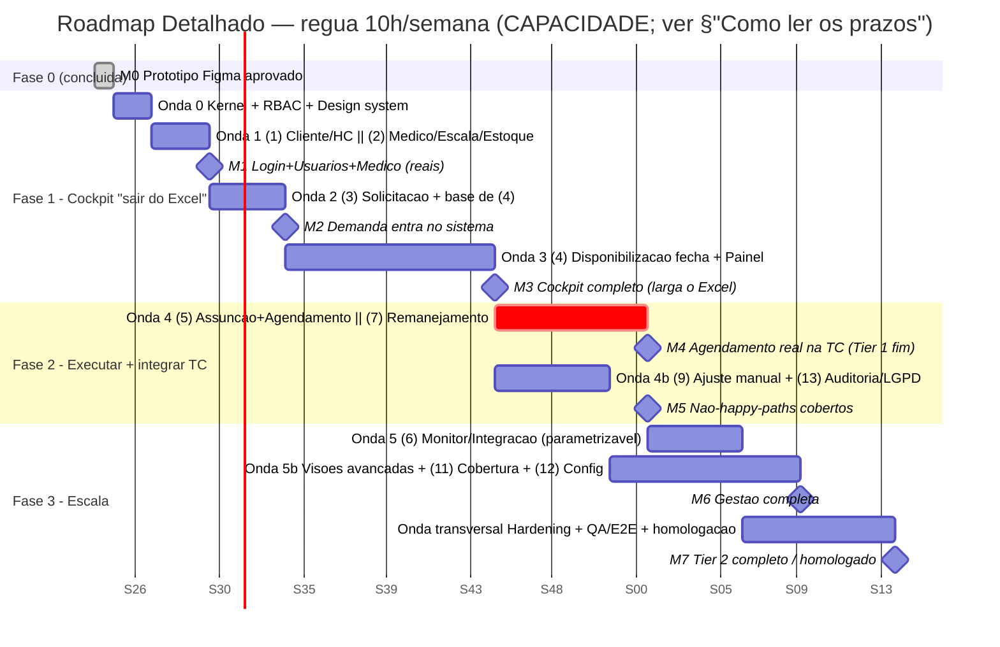

# 🧭 Roadmap Detalhado (para Diretoria + Delivery)

> Este documento une três visões que até aqui viviam separadas:
> - as **fases faturáveis** (`07-fases-entrega.md`): Fase 0 (Figma) → Fase 1 (cockpit) → Fase 2 (executar+integrar) → Fase 3 (escala);
> - o **inventário de telas/milestones** (`06-roadmap-telas.md`);
> - a **mecânica de execução** (`architecture/03-…`): SDD+TDD com **agentes de IA em paralelo em 6 ondas**.
>
> Tudo amarrado às **faixas de esforço** de `03-estimativa-esforco.md` e `05-estimativa-normal-vs-ai.md`.

## ⚠️ Como ler os prazos (leia antes de tudo)
Os prazos aqui são **CAPACIDADE**, não relógio. Eu cito as **faixas das estimativas já validadas**; não prometo data.
- Esforço (1 dev + IA, horas-ideais, faixa −20% a +35%): **Tier 1 ≈ 265–445h (provável ~330h)**, **Tier 2 ≈ 520–875h (provável ~650h)**, **Fase 2 ref. ~250–400h** (`03`).
- Tradução em semanas depende **só** da dedicação:
  - **10h/sem** (4h úteis + 6h fim de semana — parâmetro confirmado): Tier 1 ~33 sem, Tier 2 ~65 sem (`05`).
  - **~20h úteis/sem**: Tier 1 ~16–17 sem, Tier 2 ~32 sem (`03`).
  - **~36h úteis/sem**: Tier 1 ~9–10 sem, Tier 2 ~18 sem (`03`).
- "Normal" (sem IA) = AI coding **+~35%** (delta é o número mais incerto da estimativa — `05`). O ganho de IA está nas **telas/infra**, não no **motor de alocação**.

> **Convenção deste doc:** uso a régua de **10h/semana** (parâmetro confirmado em `05`) para numerar as "Semanas (S)". Se a dedicação subir, multiplique as semanas pelas razões acima — o **número de checkpoints e a ordem não mudam**, só a cadência de relógio.

## 🔗 Dependências externas (fora do nosso controle — afetam prazo, não horas)
| Dep | O quê | Bloqueia | Mitigação |
|---|---|---|---|
| **DEP-TC-1** | Novo **`PartnerType`** + **API-key** emitidos pela equipe da Teleconsulta | **Fase 2** (Agendamento → `POST /integration/appointment`) e o Monitor/Integração | Solicitar **no início da Fase 1**; construir Adapter contra **mock/contrato** enquanto a key não chega |
| **DEP-TC-2** | Acesso a **homologação** da TC + lista real de **pacientes** (funil de Assunção) | Fase 2 (Assunção seleciona paciente da TC) | Casca de UI e read-model com dados sintéticos até liberar |
| **DEP-TC-3** | **Regra da janela** de remanejamento e **fonte do funil** do Monitor (🔴 aberto, `monitor-integracao/ui.md §8`) | Onda 5 (⑥ Monitor — gatilho de prazo) | Construir casca **parametrizável**; **não inferir** a regra (Diretriz Suprema) |
| **DEP-STACK** | Decisão de stack **D-001** (define hooks de enforcement reais) | Enforcement automatizado (não a entrega de valor) | Stack nova p/ você → +15–25% (P2, `03`) |

> Marcas externas aparecem como **🔌 DEP-xxx** ao longo das ondas.

---

## 🗺️ Visão geral das fases

| Fase | Outcome (valor) | Tier coberto | Telas | Esforço (faixa, `03`/`05`) | Marco faturável |
|---|---|---|---|---|---|
| **0 — Figma** *(CONCLUÍDA)* | Diretoria **vê o produto** inteiro e aprova | — | Protótipo navegável das telas-núcleo | já entregue (não recontado, P5 `03`) | **M0** — aprovação do protótipo |
| **1 — Cockpit "sair do Excel"** | Funcionária **larga a planilha**; planejamento/decisão vive no sistema, auditável e exportável | Núcleo do Tier 1 (planejamento) | 1·Login · 2·Usuários · 3·Médico+Escala · 4·Solicitação · 5·Solicitados · 6·Disponibilização · 10·Painel | parte do Tier 1 (Tier 1 total ~265–445h) | **M1→M3** (ver gates faturáveis) |
| **2 — Executar + integrar com TC** | Atendimento **agendado de verdade na TC**; não-happy-paths cobertos | Fecha Tier 1 + parte do Tier 2 | 7·Assunção+Agendamento · 8·Remanejamento · 9·Ajuste manual · 13·Auditoria/LGPD · 12·Config | Fase 2 ref. ~250–400h | **M4→M5** |
| **3 — Escala** | Gestão completa, analítica e operação madura | Fecha Tier 2 | 11·Mapa de Cobertura · Visões avançadas · hardening/homologação | restante até Tier 2 ~520–875h total | **M6→M7** |

---

## 📊 Mermaid Gantt (régua 10h/semana — capacidade, não data)

> **Onda 4 marcada como `crit`**: carrega as invariantes médicas/financeiras (núcleo crítico, humano no loop) **e** a dependência externa **🔌 DEP-TC-1/2**. É o ponto de maior risco de calendário.

---

## 🌊 As 6 ondas de paralelização (de `architecture/03 §3`)

| Onda | Roda em paralelo | Depende de | Agentes simultâneos | Risco/observação |
|---|---|---|---|---|
| **0** | Kernel + ⑧ RBAC + Design system/tokens | — | 1–2 (kernel **humano-led**) | Pré-requisito de tudo; kernel revisado à mão (§2.2) |
| **1** | ① Cliente/HC ∥ ② Médico+Escala+Estoque | Kernel | **2** | Independentes — paralelismo limpo |
| **2** | ③ Solicitação ∥ base do ④ que só depende de ② | ①, ② | **2** | ④ é núcleo crítico → revisão reforçada (INV-2/6) |
| **3** | ④ Disponibilização **fecha** (demanda③ × estoque②) | ②, ③ | 1 (concentra revisão) | **Gargalo** de dependências; humano no loop |
| **4** | ⑤ Assunção+Agendamento ∥ ⑦ Remanejamento | ④ | **2** | ⑤ usa Adapter TC (**🔌 DEP-TC-1/2**); ⑦ usa janela D-013 |
| **5** | ⑥ Monitor/Integração | ⑤ (+Adapter) | 1 | **🔴 bloqueado na regra** (**🔌 DEP-TC-3**): só a casca, não o gatilho de prazo |
| **transversal** | ⑨ Auditoria | engancha em todos | 1 contínuo | append-only; agentes emitem eventos |

**Regras de paralelismo (invariáveis):** dois módulos só vão juntos se (a) **não compartilham fronteira de escrita** e (b) seus contratos já estão `specified`/`tested`. Mudança no **kernel** é rara e **aprovada por humano**. O **núcleo crítico** (④ e ⑤) é escrito/revisado à mão e cercado de testes (`CLAUDE.md`, princípio de risco nº 1).

---

# FASE 0 — Figma "Ver o produto" ✅ CONCLUÍDA

- **Outcome/valor:** diretoria vê todas as telas-núcleo em ~1 semana e aprova layout/fluxo barato, antes de gastar horas em código. Cada tela aprovada vira a spec da implementação real (Figma-to-code acelera o front depois).
- **Telas/módulos:** protótipo navegável de máxima fidelidade + instruções de dev (tokens, componentes, estados, UI-specs, arquitetura).
- **Critério de saída (atingido):** board **"Apresentação · Fase 0"** aprovado.
- **Marco faturável: M0** — aprovação do protótipo.
- **Nota de capacidade:** não recontado na estimativa (P5, `03`).

---

# FASE 1 — Cockpit "sair do Excel"

### Outcome / valor
O **mínimo que substitui a planilha** (`agenda-operacional-*.xlsx`). Fluxo ponta-a-ponta de **planejamento/decisão** (ainda sem execução paciente-a-paciente): cliente registra quanto precisa → nós respondemos com proposta (temos? quantos?) → administramos a decisão por **1 HC** ou **todos os clientes**. **Saída exportável** que aposenta o Excel. Resultado: a funcionária deixa de manter planilha à mão; o controle passa a viver no sistema, auditável.

### Telas e módulos
1·Login · 2·Gestão de Usuários · 3·Cadastro de Médico+Escala (→ estoque) · 4·Solicitação · 5·Gestão de Solicitados · 6·Disponibilização (a tela mais pesada) · 10·Painel consolidado. Módulos: Kernel, ⑧ RBAC, ① Cliente/HC, ② Médico+Escala+Estoque, ③ Solicitação, ④ Disponibilização, ⑨ Auditoria (transversal).

### Ondas de paralelização nesta fase
**Onda 0** (Kernel + RBAC + Design system) → **Onda 1** (① ∥ ②, 2 agentes) → **Onda 2** (③ ∥ base do ④, 2 agentes) → **Onda 3** (④ fecha — gargalo, 1 agente + revisão humana). ⑨ Auditoria roda transversal desde a Onda 0.

### Dependências
- Internas: ③ precisa de ①; ④ precisa de ② (estoque) e ③ (demanda).
- Externas: **🔌 DEP-STACK** (D-001) habilita enforcement real dos hooks. **Solicitar 🔌 DEP-TC-1 já agora** (lead time), mesmo sem usar nesta fase.

### Checkpoints semanais (régua 10h/sem)
| Semana | Onda | Checkpoint visível (sexta, ~30–45min) | O que a diretoria valida |
|---|---|---|---|
| **S1–S2** | 0 | Fundação de pé: kernel + tokens/design system + RBAC esqueleto; repo com hooks SDD+TDD desenhados | "máquina obriga spec→teste→código"; ainda sem tela real |
| **S3** | 1 | **Login + Gestão de Usuários** reais (sobre a fundação) | autenticação + papéis/escopo funcionando |
| **S4–S5** | 1 | **Cadastro de Médico + Escala** real + **estoque sendo calculado** | ② fecha; estoque visível ✅ **M1** |
| **S6–S8** | 2 | **Solicitação** real (cliente registra N×especialidade×mês) + ① Cliente/HC (púb/priv) | demanda entra no sistema ✅ **M2** |
| **S9** | 2 | Base do ④ (read-model estoque×demanda) navegável | preview da tela pesada |
| **S10–S16** | 3 | **Disponibilização** em construção: simular saldo → reservar (incremental, semana a semana) | núcleo de alocação; revisão reforçada de invariantes |
| **S17–S20** | 3 | **Disponibilização** fecha (emitir) + **Painel consolidado** (1 HC × todos) + **export** que substitui o Excel | ✅ **M3** — cockpit completo |

### Critérios de aceite / saída (Fase 1)
- Login + RBAC com escopo por HC/cliente funcionando; ② calcula estoque; ③ registra demanda; ④ simula/reserva/emite proposta respeitando invariantes (INV-2/6) cercadas de teste; Painel mostra 1 HC e consolidado público+privado; **export** gera a substituição da `agenda-operacional.xlsx`.
- Todas as specs envolvidas em `implemented`; suíte verde (hook `Stop` + CI); testes de contrato entre ①→③ e ②/③→④ passando.
- Board **"Apresentação · Fase 1"** isolado no Figma (só estas telas).

### Marcos faturáveis (Fase 1)
- **M1** (S5): "algo funcionando" — Login+Usuários+Médico/Escala reais.
- **M2** (S8): demanda entra no sistema.
- **M3** (S20): **cockpit completo — larga o Excel** (gate faturável principal da Fase 1).

> **Capacidade:** Fase 1 ≈ porção de planejamento do Tier 1. A 10h/sem ≈ **S1–S20**; a ~20h/sem comprime ~½; a ~36h/sem ~⅓ (faixas de `03`/`05`). ④ é onde a IA **menos** acelera (motor de alocação — `05`).

---

# FASE 2 — Executar + integrar com a Teleconsulta

### Outcome / valor
Adiciona **execução paciente-a-paciente** e a **integração com a TC**: o atendimento passa a ser **agendado de verdade na Teleconsulta**, e os **não-happy-paths** (remanejamento, ajuste manual) ficam cobertos, com **auditoria/LGPD**. Fecha o **Tier 1 completo** (M4) e entrega a primeira fatia do Tier 2.

### Telas e módulos
7·Assunção de Vagas (assume slot + seleciona paciente da TC + médico preferencial) · Agendamento → Teleconsulta (`POST /integration/appointment`, médico preferencial + fallback) · 8·Remanejamento (janela 24/48h) · 9·Ajuste manual de estoque (retornos/extras + auditoria) · 13·Auditoria/LGPD · 12·Configurações. Módulos: ⑤ Assunção+Agendamento, ⑦ Remanejamento, ⑨ Auditoria (consolida).

### Ondas de paralelização nesta fase
**Onda 4** (⑤ Assunção+Agendamento ∥ ⑦ Remanejamento — 2 agentes, **núcleo crítico, humano no loop**). Em paralelo, **Onda 4b** (⑨ Auditoria/LGPD + 9·Ajuste manual) pode avançar logo após a Onda 3, pois depende mais do kernel/eventos que de ④/⑤.

### Dependências
- Internas: ⑤ e ⑦ dependem de ④ (Disponibilização). ⑦ usa a **janela D-013**; ⑤ usa o **Adapter TC**.
- Externas (críticas):
  - **🔌 DEP-TC-1** — `PartnerType` + API-key da TC: **bloqueia o agendamento real**. Sem ela, construímos contra **mock/contrato** mas **não fechamos M4**.
  - **🔌 DEP-TC-2** — homologação + lista de pacientes da TC: bloqueia a seleção de paciente em Assunção.

### Checkpoints semanais (régua 10h/sem — continuando a numeração)
| Semana | Onda | Checkpoint visível | O que a diretoria valida |
|---|---|---|---|
| **S21–S24** | 4b | **Auditoria/LGPD** append-only + **9·Ajuste manual** (retornos/extras com trilha) | rastreabilidade e correção de estoque |
| **S21–S26** | 4 | **Assunção** (assume slot + seleciona paciente — contra mock até **🔌 DEP-TC-2**) | jornada de execução visível |
| **S27–S30** | 4 | **Agendamento → TC** com **🔌 DEP-TC-1** ativa (médico preferencial + fallback); **Remanejamento** (⑦, janela D-013) | ✅ **M4** — **agendamento real na TC (Tier 1 completo)** |
| **S31–S34** | 4 | Estabilização ⑤/⑦ + casos de borda + ⑨ consolida eventos de execução | ✅ **M5** — não-happy-paths cobertos |

### Critérios de aceite / saída (Fase 2)
- ⑤ agenda na TC via Adapter real (`POST /integration/appointment`) com médico preferencial + fallback, testes de contrato contra as specs da TC (`PRD-002…/api-contracts.md`); ⑦ redistribui dentro da janela D-013; 9·Ajuste manual com trilha; ⑨ Auditoria/LGPD append-only cobrindo todos os eventos.
- Suíte verde; testes de contrato ④→⑤ e ④→⑦ passando; **🔌 DEP-TC-1/2 confirmadas** (sem elas, M4 fica em "construído contra mock — pendente de key").
- Board **"Apresentação · Fase 2"** isolado.

### Marcos faturáveis (Fase 2)
- **M4** (S30): **Tier 1 completo** — agendamento real na TC. *(Gate dependente de 🔌 DEP-TC-1/2.)*
- **M5** (S34): não-happy-paths (remanejamento + ajuste manual + auditoria/LGPD).

> **Capacidade:** Fase 2 referência **~250–400h** (`03`). ⑤ (integração) e o debug de borda são onde a IA **acelera pouco** e cobra "imposto de verificação" (`05`). **Risco de calendário** concentrado em **🔌 DEP-TC-1/2** (espera externa, não horas).

---

# FASE 3 — Escala

### Outcome / valor
Operação madura e **gestão completa**: cobertura analítica, visões avançadas, Monitor/Integração com gatilho de prazo, configurações completas e **hardening + homologação** que fecham o **Tier 2 completo**.

### Telas e módulos
11·Mapa de Cobertura (+ "PDF Modelo") · 10·Painel/Visões avançadas (macro, por governo, contratação) · 12·Configurações (especialidades, HCs, parâmetros) · ⑥ Monitor/Integração TC · hardening, QA/E2E, LGPD final, homologação. Futuro: remanejamento automático, mobile (Gestor), multi-cliente avançado, BI.

### Ondas de paralelização nesta fase
**Onda 5** (⑥ Monitor/Integração — **só a casca parametrizável**: UI/funil/read-model; **não o gatilho de prazo** até 🔴 resolver) ∥ **Onda 5b** (Visões avançadas + 11·Cobertura + 12·Config). Encerra na **Onda transversal** de hardening/QA/E2E/homologação.

### Dependências
- Internas: ⑥ depende de ⑤ (+Adapter).
- Externas: **🔌 DEP-TC-3** — regra da **janela** e **fonte do funil** do Monitor (🔴 aberto, `monitor-integracao/ui.md §8`): **agentes não inferem**; constroem casca e param na regra. **🔌 DEP-TC-2** (homologação) para o E2E final.

### Checkpoints semanais (régua 10h/sem)
| Semana | Onda | Checkpoint visível | O que a diretoria valida |
|---|---|---|---|
| **S35–S39** | 5 | **⑥ Monitor/Integração** — casca (funil/read-model) parametrizável; gatilho de prazo **parado na regra** (🔌 DEP-TC-3) | observabilidade da integração; pendência de regra explícita |
| **S35–S48** | 5b | **Visões avançadas** + **11·Mapa de Cobertura** (+PDF Modelo) + **12·Configurações** completas | gestão completa por HC/governo/contratação ✅ **M6** |
| **S49–S58** | transversal | **Hardening + QA/E2E + LGPD final + homologação** (🔌 DEP-TC-2) | sistema homologado ✅ **M7** |

### Critérios de aceite / saída (Fase 3)
- Visões macro/por-governo/contratação completas; 11·Cobertura com PDF Modelo; 12·Config (especialidades/HCs/parâmetros) editáveis; ⑥ Monitor com gatilho **somente após 🔌 DEP-TC-3 confirmada e virar D-xxx**; suíte E2E verde em homologação; checklist LGPD fechado.
- Board **"Apresentação · Fase 3"** isolado.

### Marcos faturáveis (Fase 3)
- **M6** (S48): gestão completa (visões + cobertura + config).
- **M7** (S58): **Tier 2 completo / homologado** (gate faturável final).

> **Capacidade:** total acumulado até aqui = **Tier 2 ≈ 520–875h (provável ~650h)** (`03`/`05`). A 10h/sem ≈ ~65 semanas no total; ~32 a 20h/sem; ~18 a 36h/sem.

---

## 📋 Tabela mestre — o que cada semana entrega (régua 10h/sem)

| Sem | Fase | Onda | Entrega visível (checkpoint de sexta) | Marco | Dep. externa |
|---|---|---|---|---|---|
| S0 | 0 | — | Protótipo Figma aprovado | **M0** | — |
| S1 | 1 | 0 | Kernel + tokens/design system de pé | | 🔌 DEP-STACK |
| S2 | 1 | 0 | RBAC esqueleto + hooks SDD+TDD desenhados | | 🔌 DEP-STACK |
| S3 | 1 | 1 | **Login + Gestão de Usuários** reais | | |
| S4 | 1 | 1 | **Médico + Escala** (início) | | |
| S5 | 1 | 1 | **Médico+Escala** fecha + **estoque calculado** | **M1** | |
| S6 | 1 | 2 | ① Cliente/HC (público/privado) | | |
| S7 | 1 | 2 | **Solicitação** (início) | | |
| S8 | 1 | 2 | **Solicitação** fecha (demanda no sistema) | **M2** | |
| S9 | 1 | 2 | Read-model estoque×demanda (base do ④) | | |
| S10–S13 | 1 | 3 | **Disponibilização**: simular saldo (incremental) | | |
| S14–S16 | 1 | 3 | **Disponibilização**: reservar | | |
| S17–S19 | 1 | 3 | **Disponibilização**: emitir + **Painel consolidado** | | |
| S20 | 1 | 3 | **Export** substitui o Excel — **cockpit completo** | **M3** | |
| S21–S23 | 2 | 4b | **Auditoria/LGPD** + **9·Ajuste manual** | | |
| S21–S26 | 2 | 4 | **Assunção** (paciente via mock) | | 🔌 DEP-TC-2 |
| S27–S29 | 2 | 4 | **Agendamento → TC** real + **Remanejamento** | | 🔌 DEP-TC-1 |
| S30 | 2 | 4 | Agendamento real validado | **M4** | 🔌 DEP-TC-1/2 |
| S31–S33 | 2 | 4 | Estabilização ⑤/⑦ + casos de borda | | |
| S34 | 2 | 4 | ⑨ consolida eventos de execução | **M5** | |
| S35–S39 | 3 | 5 | **⑥ Monitor** (casca; gatilho parado na regra) | | 🔌 DEP-TC-3 |
| S40–S47 | 3 | 5b | **Visões avançadas** + **11·Cobertura** + **12·Config** | | |
| S48 | 3 | 5b | Gestão completa | **M6** | |
| S49–S57 | 3 | transv. | **Hardening + QA/E2E + LGPD final** | | 🔌 DEP-TC-2 |
| S58 | 3 | transv. | **Homologação** concluída | **M7** | 🔌 DEP-TC-2 |

> A faixa pessimista (+35%) empurra o calendário; a otimista (−20%) puxa. **Não tratar S58 como data** — é o fim da **capacidade Tier 2** na régua de 10h/sem.

## ⏱️ Cadência de checkpoint (todas as fases)
Toda **sexta** (~30–45 min), gate de validação (`03 §"Gates semanais"`):
1. **Demo** das specs que passaram `specified → tested → implemented` (visível no `STATUS.md`).
2. **Aceite** das specs (você valida que "resolve a dor", não só "funciona").
3. **Revisão do backlog** + replanejamento da semana.
4. **Log de mudanças** (`change-requests.md`).
5. **Gatilho de pagamento** se atrelado a milestone (`04-custo-e-proposta.md`).
6. **+1 tela visível** (protótipo Figma → versão real), sempre amarrada a `02-scope-entrega-1.md`.

> Cada gate é onde "o humano valida e a IA aprende": correções viram regra em `CLAUDE.md`/skills/hooks — o repo fica mais calibrado ao negócio a cada semana.

## ✅ Resumo dos marcos faturáveis
| Marco | Fase | Sem (~10h) | Gatilho de valor |
|---|---|---|---|
| **M0** | 0 | S0 | Protótipo aprovado |
| **M1** | 1 | S5 | "Algo funcionando" (Login+Usuários+Médico/Escala) |
| **M2** | 1 | S8 | Demanda entra no sistema |
| **M3** | 1 | S20 | **Cockpit completo — larga o Excel** |
| **M4** | 2 | S30 | **Tier 1 completo — agendamento real na TC** *(🔌 DEP-TC-1/2)* |
| **M5** | 2 | S34 | Não-happy-paths cobertos |
| **M6** | 3 | S48 | Gestão completa |
| **M7** | 3 | S58 | **Tier 2 completo / homologado** |

> **Recomendação de delivery (de `05`):** a 10h/sem, faturar **por marco** e tratar **Tier 1 (até M4) como Entrega 1** — entrega valor e a integração com a TC cedo, e fatura antes de fechar o Tier 2 inteiro (que a 10h/sem é ~15 meses até o primeiro faturamento cheio — risco de fôlego/caixa). A **maior alavanca de prazo é a dedicação semanal**, muito mais que IA × normal.
